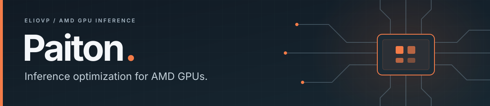

<p align="center">
  <a href="#community-releases">Explore the models</a> ·
  <a href="#quick-start">Run locally</a> ·
  <a href="https://github.com/Eliovp-BV/paiton-vllm-plugin/releases">Releases</a> ·
  <a href="https://eliovp.com/products/paiton">Discover Paiton</a>
</p>

**Paiton is an inference optimization framework for AMD GPUs.** We combine
compiler optimizations, custom kernels and runtime integration to improve
performance and memory efficiency for language, image and video workloads.

Here we share our **free RDNA community releases**: optimized runtimes,
reproducible containers and simple commands for running AI on your own hardware.

## Community releases

These releases are our way of giving back to the AMD community: helping more
people build, experiment and create with local AI.

**Current target: Radeon AI PRO R9700 · 32 GB VRAM · RDNA 4 (`gfx1201`).**

| Model & setup guide | What you can do |
| --- | --- |
| [**Wan2.2 / FastWan 5B**](models/Wan2.2/README.md) | Generate silent text/image video in ComfyUI or the terminal; local release candidate |
| [**MiniMax H3**](models/MiniMax-H3/README.md) | Generate video with native stereo audio in ComfyUI or the terminal |
| [**FLUX.2 klein 4B**](models/FLUX.2-klein/README.md) | Create images in ComfyUI, a simple web interface or the terminal |
| [**Qwen3.8 27B**](models/Qwen3.8/README.md) | Chat, code and generate text with a terminal client or OpenAI-compatible API |
| [**Ornith 1.5 35B A3B**](models/Ornith-1.5/README.md) | Chat and generate text with a terminal client or OpenAI-compatible API |
| [**Qwen3-Coder 30B A3B**](models/Qwen3-Coder-30B/README.md) | Write, review and test code through terminal chat or a local coding API |

## Quick start

You need **Linux, Docker and a working AMD GPU driver**. ComfyUI also needs
Docker Compose. Each model guide covers RAM, disk, GPU device access and
supported generation settings.

Choose a model below. The first launch downloads and prepares its weights;
allow time for loading and compilation. Caches persist for later runs.
Run one model at a time.

<details>
<summary><strong>Create silent videos with Wan2.2</strong> · Text and optional image input</summary>

```bash
./models/Wan2.2/launch.sh
```

From a checkout containing the Wan release candidate, open [ComfyUI](http://127.0.0.1:8192/?paiton=1&preset=fast). Use FastWan for fast text previews or the base workflow for image upload. Select stock/Paiton, duration and resolution in the connected workflow.

[Setup, measured performance and example clips →](models/Wan2.2/README.md)

</details>

<details>
<summary><strong>Create videos with MiniMax H3</strong> · ComfyUI with stereo audio</summary>

```bash
git clone --depth 1 https://github.com/Eliovp-BV/paiton-vllm-plugin.git && cd paiton-vllm-plugin && ./models/MiniMax-H3/launch.sh
```

Open [ComfyUI](http://127.0.0.1:8190/?paiton=1&studio=1), edit the prompt, optionally upload first/last images, set the length and resolution sliders, and click **Run**.
From another system, use `http://<server-ip>:8190/?paiton=1&studio=1` with the host's network address.
The first launch prepares the local runtime and downloads the model; later launches reuse both.

[Generated clips, performance and setup guide →](models/MiniMax-H3/README.md)

</details>

<details>
<summary><strong>Code with Qwen3-Coder 30B</strong> · Terminal chat and coding API</summary>

```bash
git clone --depth 1 https://github.com/Eliovp-BV/paiton-vllm-plugin.git && cd paiton-vllm-plugin && ./models/Qwen3-Coder-30B/serve-docker.sh --chat
```

The prebuilt container downloads and caches the pinned INT4 model on first use.
Coding clients can connect to `http://127.0.0.1:8010/v1`, model `qwen3-coder`.

[Download the bundle](https://github.com/Eliovp-BV/paiton-vllm-plugin/releases/download/qwen3-coder-30b-awq-rdna4-v1.0.0/paiton-qwen3-coder-r9700-v1.0.0.tar.gz) ·
[Full guide, requirements and coding client settings →](models/Qwen3-Coder-30B/README.md)

</details>

<details>
<summary><strong>Generate images with FLUX.2 klein</strong> · ComfyUI</summary>

```bash
git clone --depth 1 https://github.com/Eliovp-BV/paiton-vllm-plugin.git && cd paiton-vllm-plugin && ./models/FLUX.2-klein/launch.sh
```

Open [ComfyUI](http://127.0.0.1:8188/?paiton=1), enter a prompt and click **Run**.
The included workflow lets you select **Paiton** or **Stock (Diffusers)**.

[Full guide, requirements and other interfaces →](models/FLUX.2-klein/README.md)

</details>

<details>
<summary><strong>Start Qwen3.8</strong> · Chat and API</summary>

```bash
git clone --depth 1 https://github.com/Eliovp-BV/paiton-vllm-plugin.git && cd paiton-vllm-plugin && ./models/Qwen3.8/serve-docker.sh
```

Once the server reports that it is ready, open a terminal chat:

```bash
docker exec -it paiton-qwen38 paiton-chat
```

[Full guide, API examples and existing-environment installation →](models/Qwen3.8/README.md)

</details>

<details>
<summary><strong>Chat with Ornith 1.5</strong> · Chat and API</summary>

```bash
git clone --depth 1 https://github.com/Eliovp-BV/paiton-vllm-plugin.git && cd paiton-vllm-plugin && ./models/Ornith-1.5/serve-docker.sh --chat
```

The helper starts the server, waits for it to become ready and opens the
terminal chat. Use `/reset` for a new conversation and `/quit` to leave the chat.

[Full guide, API examples and model options →](models/Ornith-1.5/README.md)

</details>

Already cloned the repository? Run the `./models/…` command for your chosen
model from the repository root.

## Performance you can inspect

Our benchmarks document the hardware, settings, stock comparisons and quality
checks behind each result:
[Qwen3.8](https://eliovp.com/blog/paiton-qwen38-radeon-ai-pro-r9700) ·
[Ornith 1.5](models/Ornith-1.5/BENCHMARKS.md) ·
[Qwen3-Coder 30B](models/Qwen3-Coder-30B/BENCHMARKS.md) ·
[FLUX.2 klein](models/FLUX.2-klein/BENCHMARKS.md) ·
[MiniMax H3](models/MiniMax-H3/BENCHMARKS.md).
Use the model guides for current release settings and reproduction commands.

## Beyond the community releases

Paiton's broader work covers **AMD Instinct (CDNA)** accelerators and multi-GPU
inference for larger language, image and video workloads.

**[Explore Paiton and discuss your workload →](https://eliovp.com/products/paiton)**

## About this repository

This repository distributes public runtimes and compiled artifacts. Paiton's
compiler is developed privately. Text serving uses vLLM; image generation uses
Diffusers with ComfyUI integration. MiniMax H3 uses the native ComfyUI video
pipeline with Paiton artifacts, assembled locally from pinned components.

The vLLM plugin is [Apache-2.0 licensed](LICENSE). Model weights and bundled
components retain their own licenses, including GPL-3.0-only for the separate
image conversion/stock tools and ComfyUI. See the
[third-party notices](THIRD_PARTY_NOTICES.md) and
[image package notices](models/FLUX.2-klein/THIRD_PARTY_NOTICES.md) and
[video package notices](models/MiniMax-H3/THIRD_PARTY_NOTICES.md).

[Release downloads](https://github.com/Eliovp-BV/paiton-vllm-plugin/releases) ·
[Containers](https://github.com/users/Eliovp/packages/container/package/paiton-vllm-plugin) ·
[Hugging Face](https://huggingface.co/EliovpAI) ·
[Report an issue](https://github.com/Eliovp-BV/paiton-vllm-plugin/issues)
