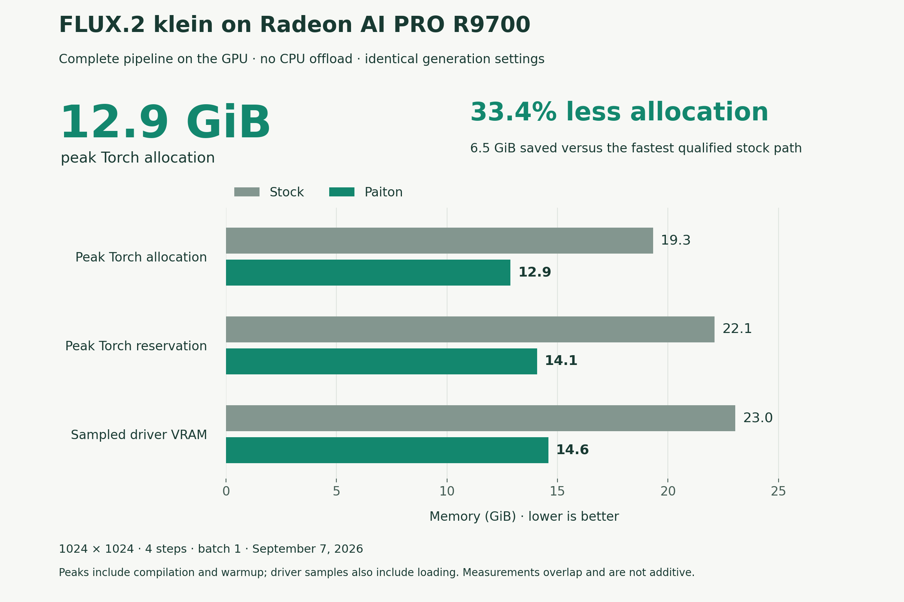
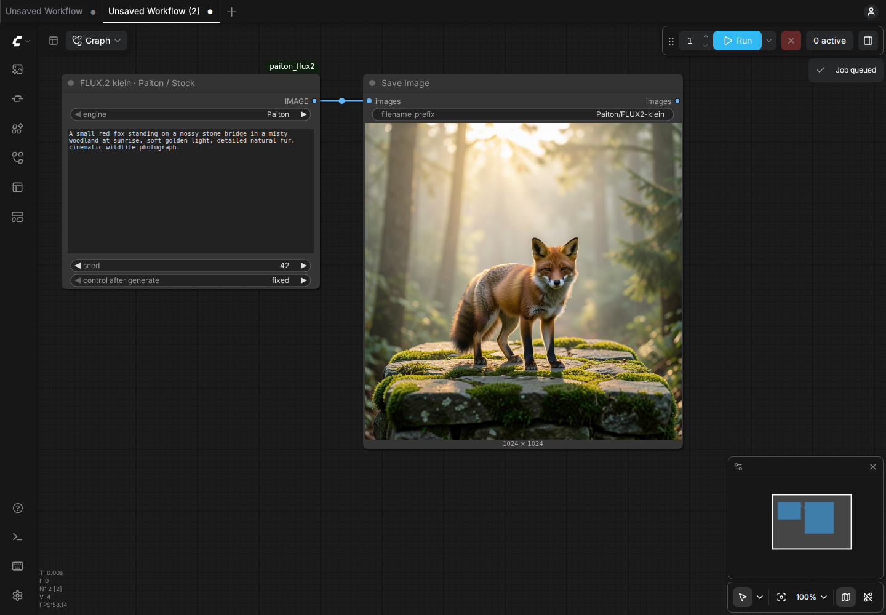
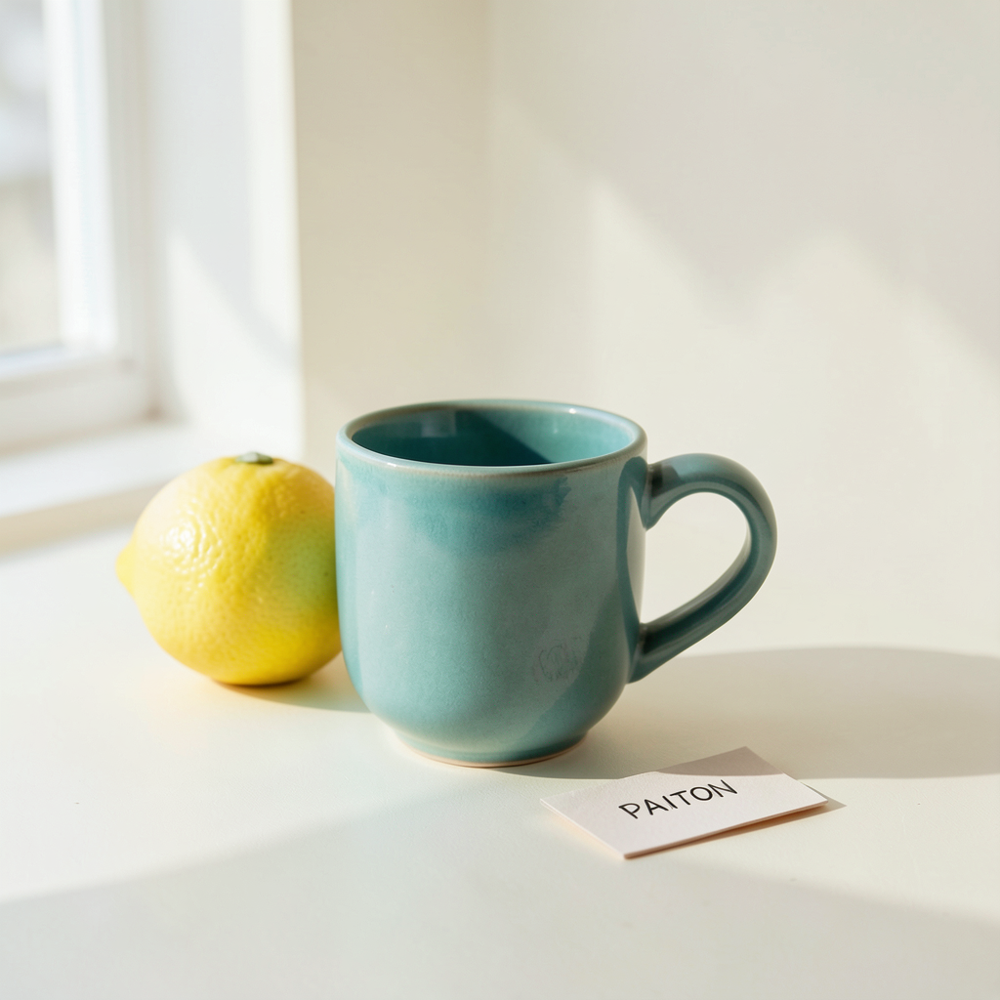

# FLUX.2 klein with Paiton on Radeon

Create photographs, product concepts and illustrations locally on one **Radeon
AI PRO R9700, 32 GB (`gfx1201`)**. This free profile generates 1024 × 1024 images
in four steps, with the complete pipeline resident on the GPU.


The retained three-prompt comparison averages **1.054 seconds per image**
with Paiton versus **1.258 seconds** for the strongest qualified stock
configuration: **16.2% lower latency** and **19.4% more images per hour**.
These are warm prompt-to-PIL timings, excluding startup and PNG writing.
See the [benchmark record](BENCHMARKS.md) for settings, raw timings and quality.

**Peak Torch allocation is just 12.9 GiB, versus 19.3 GiB for stock, a 33.4% reduction.**
Peak reservation is 14.1 GiB and maximum sampled driver VRAM is 14.6 GiB.
The complete pipeline stays on the GPU without CPU offload. These overlapping
measurements include compilation and warmup; 12.9 GiB is not total VRAM use.



## Start ComfyUI with one command

```bash
git clone --depth 1 https://github.com/Eliovp-BV/paiton-vllm-plugin.git && cd paiton-vllm-plugin && ./models/FLUX.2-klein/launch.sh
```

The helper pulls the pinned containers, downloads and prepares the model once,
keeps a persistent cache, and starts [ComfyUI](http://127.0.0.1:8188/?paiton=1).
The first visit opens a connected workflow. Edit the prompt and click **Run**.
Choose **Paiton** or **Stock (Diffusers)** in the image node. The preview and
standard Save Image node work normally. Images are saved in `paiton-images/`.



The first image loads and compiles the model and can take several minutes.
Later images reuse the loaded engine. Switching engines unloads the previous
model and pays the loading/setup cost again. For a comparison, use the same
prompt and seed and set the seed control to **fixed**.

From this model directory, use `./launch.sh --logs` to follow startup and
`./launch.sh --stop` to stop the services. Stopping preserves images, model
caches and ComfyUI user settings. `./launch.sh --build` builds the same containers
locally from the pinned recipes instead of pulling them.

For a smaller prompt-and-image interface:

```bash
./launch.sh --ui simple
```

Open [the simple interface](http://127.0.0.1:7860). It keeps Paiton loaded while
the command runs; right-click an image to save it. Stop with Ctrl-C. Both
interfaces bind their host ports to localhost.

## Example images

| Wildlife photograph | Product concept | Watercolor illustration |
| --- | --- | --- |
|  |  |  |

These are retained Paiton outputs from the benchmark prompts and seeds.

## Requirements and supported scope

- Linux, a working AMD GPU driver, and one Radeon AI PRO R9700 with 32 GB VRAM.
- Docker Engine with the Compose plugin and access to `/dev/kfd` and `/dev/dri`.
- 16 GB system RAM was tested; 24 GB provides more compilation headroom.
- Allow 60 GB of free disk for containers, source weights, prepared tensors,
  compilation caches and outputs. The download is 5.46 GB and the prepared
  tensors occupy about 12 GB.
- Internet access for container setup and the first download. Cached generation
  runs locally without a paid service, model API or cloud GPU.

This release qualifies text-to-image, batch one, 1024 × 1024, four steps,
guidance 1.0 and a 512-token text sequence. Editing, adapters, other resolutions
and other GPUs are outside this profile. The ComfyUI bundle runs its interface
and image handling on the CPU; the selected local engine performs generation on
the Radeon. General ComfyUI GPU workflows are not qualified by this bundle.

The `paiton-flux2-cache` Docker volume retains prepared tensors, and
`paiton-flux2-cache-runtime` retains source weights and compilation caches.
Set `PAITON_CACHE` to another volume prefix or an absolute host directory.
With a host directory, source and compilation caches live in its `cache/` subdirectory. `PAITON_OUTPUTS` selects the host image directory. The ComfyUI user
volume is `paiton-flux2-comfy-user`. `PAITON_UI_PORT` changes its localhost port.
Image tags can be overridden with `PAITON_IMAGE`, `PAITON_TOOLS_IMAGE` and
`PAITON_COMFYUI_IMAGE` for local builds.

## Generate from a terminal

Stop ComfyUI with `./launch.sh --stop` before starting a separate terminal
pipeline. From this directory, download the published runtime and prepare the cache:

```bash
docker pull ghcr.io/eliovp/paiton-vllm-plugin:flux2-klein-rdna4-v1.0.1
docker pull ghcr.io/eliovp/paiton-vllm-plugin:flux2-tools-rdna4-v1.0.1
./run.sh download
./run.sh generate --prompt 'A teal ceramic coffee cup beside a lemon, soft window light, product photograph' --seed 42
```

The PNG appears in `outputs/image.png`. `--count 4` tries four consecutive seeds
in one loaded process. `--output /outputs/example.png` chooses a filename.
Warm generation timings exclude process startup, PNG encoding and file writing.

## Reproduce the comparison

Stop the interface first and run these sequentially on an otherwise idle GPU:

```bash
./launch.sh --stop
./run.sh benchmark --backend stock --suite --output /outputs/stock
./run.sh benchmark --backend paiton --suite --output /outputs/paiton
```

Each command performs two warmups and two measured runs for each of three fixed
prompts, with seeds 42, 31415 and 2026. Use fresh output directories. Removing
`--suite` selects the fox prompt at seed 42. The timed interval includes text
encoding, all four denoising steps, VAE decoding and conversion to a PIL image.
It excludes PNG encoding and writing. Outputs, final latents, wall/component
timings, memory peaks, process RSS, versions and hardware telemetry are retained.

Stock uses Diffusers, SDNQ attention and matrix kernels, prepared immutable
transformer weights, a channels-last VAE, whole-module compilation and graph
capture. Both paths expose only the text-encoder outputs consumed by FLUX so the
standard compiler can eliminate unused work. Stock weight freezing and vendor
convolution autotuning were evaluated; neither improved the complete pipeline
in the retained qualification. The Paiton path uses compiled transformer and
decoder artifacts with equivalent prepared INT8 values. Both retain BF16 text
encoding and VAE arithmetic, INT8 QK/BF16 PV transformer attention with FP32
softmax, and the same scheduler and generation settings. Neither uses offload.

## Use the node in an existing ComfyUI installation

Copy `comfyui/custom_nodes/paiton_flux2` into the installation's `custom_nodes/`
directory and restart ComfyUI. Start this package's engine services with the
launch helper, then open `comfyui/custom_nodes/paiton_flux2/example_workflows/Generate.json`
in your existing interface. For ComfyUI running directly on the same host, the
node's default engine addresses are `http://127.0.0.1:7861` and
`http://127.0.0.1:7862`. Container installations can set `PAITON_FLUX2_ENDPOINT`
and `PAITON_STOCK_ENDPOINT` to reachable addresses for these local services.
Both services must be running for engine switching. The node returns a standard
ComfyUI `IMAGE` for preview, saving and downstream image processing.

The bundled configuration is the tested route. Avoid keeping other GPU models
loaded while using the R9700 generation engine.

## Pinned software and model

All Dockerfiles pin the common base image by digest. It supplies PyTorch
`2.12.0+rocm7.14.0`, HIP `7.14.60850`, Triton
`3.7.1+git0263a6a6.rocm7.14.0`, Transformers `5.15.1` and Accelerate `1.14.0`.
Diffusers is `0.40.0`. SDNQ `0.2.6` is in the separate conversion/stock image.
ComfyUI is `0.34.0`, commit `12d5279438bfefc058a269eae805ceab6047777f`, with
frontend `1.49.6`; additional packages are pinned in `requirements.comfyui.txt`.

Compiled artifacts are also available on [Hugging Face](https://huggingface.co/EliovpAI/FLUX.2-klein-4B-Paiton-RDNA4).
The containers already include them, so no separate artifact download is needed.

The only downloaded checkpoint is
[Disty0/FLUX.2-klein-4B-SDNQ-4bit-dynamic](https://huggingface.co/Disty0/FLUX.2-klein-4B-SDNQ-4bit-dynamic)
at revision `45e9cc76cb70f84473ce5c6c2e2282d0ef3c6ecd`. A separate conversion
process writes plain INT8/BF16 tensors and per-file hashes. It preserves the
source, needs no calibration or remote GPU, and does not download the original
full-precision checkpoint. Paiton inference does not contain or import SDNQ.

## Licenses and quality

The original [FLUX.2 klein 4B](https://huggingface.co/black-forest-labs/FLUX.2-klein-4B)
weights are Apache 2.0. The community quantization card declares that license
but retains a contradictory non-commercial link and does not pin the exact
pre-quantization source revision. These provenance limitations are disclosed;
weights are downloaded separately and are not redistributed in these images.

The public Paiton runtime, node, service and artifacts are Apache 2.0. Separate
conversion/stock tools and ComfyUI are GPL-3.0-only. Their source and notices are
retained in the respective images. See `LICENSE`, `NOTICE`,
`THIRD_PARTY_NOTICES.md` and `tools/LICENSE`. Model-specific compiled artifacts
are included; the private Paiton compiler is not distributed.

Generated text, anatomy and fine detail can be imperfect. Identical seeds do
not guarantee identical pixels across backends or separately compiled processes.
The article includes retained images, numerical comparisons and limitations.

[Paiton](https://eliovp.com/products/paiton) also covers CDNA accelerators for
larger inference workloads.
