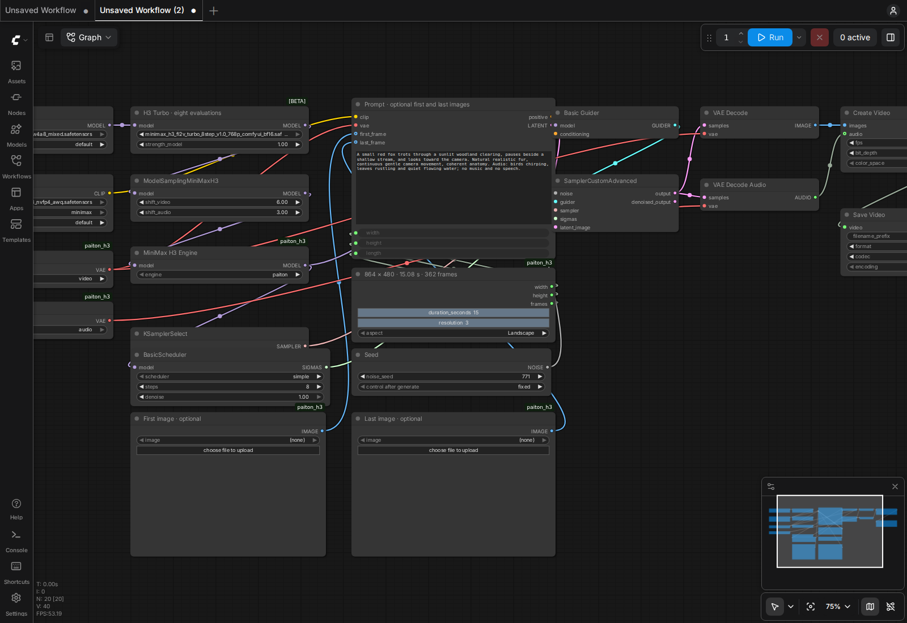

# MiniMax H3 with Paiton on Radeon

Create **video with native stereo audio** locally on one **Radeon AI PRO R9700, 32 GB**. The included workflow generates a continuous **15.08-second, 864×480 clip at 24 fps**. Powered by MiniMax H3.

Paiton takes **332.85 seconds** versus **399.40 seconds** for the matched stock request: **16.66% lower end-to-end latency** and **19.99% more clips per hour**. Fresh conditioning, video/audio decoding and writing a playable MP4 are included. All three paired long clips have equal video/audio latents and byte-identical MP4s.

[](https://huggingface.co/EliovpAI/MiniMax-H3-W4A8-Paiton-RDNA4/resolve/main/assets/fox-15s.mp4)

[Play the generated 15-second clip](https://huggingface.co/EliovpAI/MiniMax-H3-W4A8-Paiton-RDNA4/resolve/main/assets/fox-15s.mp4) · [Hugging Face runtime package](https://huggingface.co/EliovpAI/MiniMax-H3-W4A8-Paiton-RDNA4)

## Start ComfyUI with one command

```bash
git clone --depth 1 https://github.com/Eliovp-BV/paiton-vllm-plugin.git && cd paiton-vllm-plugin && ./models/MiniMax-H3/launch.sh
```

Open [ComfyUI](http://127.0.0.1:8190/?paiton=1&studio=1) on the host, or `http://<server-ip>:8190/?paiton=1&studio=1` from another system. Replace `<server-ip>` with the host's network address. The first visit opens the connected **Turbo8 studio workflow**, initially set to 15 seconds. Edit the prompt and click **Run**. Choose **paiton** or **stock** in **MiniMax H3 Engine**. Keep the seed fixed when comparing engines.

Use **Video length and resolution** to change the requested duration (5–15 seconds), resolution level (1: 576×320, 2: 704×384, 3: 864×480), and Landscape/Portrait/Square aspect. Portrait swaps the dimensions; Square uses the shorter edge. The node title shows the actual dimensions, frame count and rounded duration.

Upload an image in **First image · optional** to animate it. Optionally upload a **Last image** to guide the ending. Keep both set to **(none)** for text-to-video. These use the same FL2VA model and its full vision encoder; no additional checkpoint is needed. First images are stretched to the selected canvas; last images are center-cropped, so matching the canvas aspect gives more predictable composition. Audio remains enabled.

Already used the interface? Open `http://<server-ip>:8190/?paiton=1&studio=1` to load the new template once, or select `turbo8-studio.json` from the workflow templates. Save your current workflow before switching.



The helper pulls the versioned GHCR artifact image, prepares pinned ComfyUI components locally, verifies the model downloads and starts the interface. Models and caches persist in `~/.local/share/paiton/minimax-h3/` (or your XDG data directory); videos go to `~/paiton-videos/`. Both paths are independent of the working directory. Subsequent launches reuse the local image and model cache. ComfyUI listens on all IPv4 interfaces (`0.0.0.0`) so other systems can connect to the host's address.

To update an existing Git checkout, finish any running generation, then run these commands from the repository root:

```bash
./models/MiniMax-H3/launch.sh --stop
git pull --ff-only
./models/MiniMax-H3/launch.sh
```

This update prepares a new **local** ComfyUI image (`local-v1.0.1`) using the existing GHCR `minimax-h3-rdna4-v1.0.0` artifact. It reuses the model cache; no new published image or model download is required. Existing release, clip and benchmark links remain valid.

From this model directory, `./launch.sh --logs` follows startup and `./launch.sh --stop` stops H3 while preserving caches, videos and user settings. `PAITON_H3_DATA`, `PAITON_H3_OUTPUTS` and `PAITON_H3_PORT` override those defaults. Stop other GPU generation workloads before starting H3.

With weights already present, the first 15-second requests took **423.6 s stock** and **381.0 s Paiton**, after process setup. First download, verification, local image preparation and a cold disk/runtime cache add time. One **32 GB R9700** is required. Long-clip sampled driver memory reached **30.34 GiB**. We tested **16 GB system RAM with 4 GB swap**; lifetime process RSS reached 12.09 GiB, and up to 1.24 GiB of process swap was sampled. **24 GB or more host RAM is recommended** for the browser, longer requests and other applications. Allow **60 GB free disk** for the approximately 6 GB image, 33.96 GB selected weights, caches and outputs. Both adapters share the large components and total 35.92 GB of checkpoint files. Use SSD storage. Filesystems without hard-link support can require another 34 GB for duplicate cache copies.

## Choose a workflow

| Workflow | Output | Purpose |
| --- | --- | --- |
| `turbo8-studio.json` | Adjustable; defaults to 362 frames | Default; optional first/last images, eight evaluations |
| `turbo4-studio.json` | Adjustable; defaults to 124 frames | Optional first/last images, four evaluations |
| `turbo8-15s.json` | 362 frames, 15.0833 s | Original fixed continuous scene; eight evaluations |
| `turbo8.json` | 124 frames, 5.1667 s | Shorter eight-step scene |
| `turbo4.json` | 124 frames, 5.1667 s | Faster four-step alternative with a quality tradeoff |

All default to 864×480, 24 fps and native 32 kHz stereo. Studio templates also expose smaller canvases. Find them in the included workflow templates or load the JSON from `comfyui/workflows/`. H3 snaps frame counts upward to its `17k+5` grid: requesting 360 frames produces 362. It does not produce exactly 15.000 seconds at this setting.

To add the faster short preset, run `./run.sh download --profile turbo4` and open `turbo4.json`. To install only Turbo4 initially, use `PAITON_H3_PRESET=turbo4 ./launch.sh` and open the URL printed by the launcher.

## Terminal generation

Stop the interface before launching a separate GPU pipeline:

```bash
./launch.sh --stop
./run.sh download --profile turbo8
./run.sh generate --engine paiton --preset turbo8 --frames 362 \
  --prompt 'A small red fox trots through a sunlit woodland clearing, pauses beside a shallow stream, and looks toward the camera. Natural realistic fur, continuous gentle camera movement, coherent anatomy. Audio: birds chirping, leaves rustling and quiet flowing water; no music and no speech.' \
  --seed 771 --output /outputs/fox-15s
```

The clip is saved as `~/paiton-videos/fox-15s/clip-0.mp4`. For a faster short request use `--preset turbo4 --frames 124` after downloading its adapter. `generate` includes startup for each new process; benchmark mode keeps the pipeline loaded.

## Reproduce the comparison

```bash
./launch.sh --stop
./run.sh benchmark --engine stock --preset turbo8 --frames 362 --output /outputs/stock-15s
./run.sh benchmark --engine paiton --preset turbo8 --frames 362 --output /outputs/paiton-15s
./run.sh report /outputs/paiton-15s
./run.sh inspect /outputs/paiton-15s/clip-2.mp4 --output /outputs/paiton-15s/quality
```

Each benchmark performs one warmup and two measured requests, encoding the prompt afresh every time. It retains commands, MP4s, raw timings, latent tensors and telemetry. Use fresh output directories and run the engines sequentially with the same settings. ComfyUI's node cache may reuse identical requests, so cached UI timings are a separate scenario.

| Matched Turbo8, 15.08-second clip | Stock | Paiton |
| --- | ---: | ---: |
| Complete playable MP4 | 399.40 s | **332.85 s** |
| Pipeline before file encoding | 385.60 s | 318.98 s |
| Fixed-length clips per hour | 9.01 | **10.82** |
| Generated video seconds per wall second | 0.0378 | 0.0453 |


The earlier three-prompt qualification also measured the short presets:

| Matched preset, 5.17-second clip | Stock | Paiton | Lower latency |
| --- | ---: | ---: | ---: |
| Turbo4, four evaluations | 64.15 s | 54.38 s | 15.24% |
| Turbo8, eight evaluations | 95.83 s | 80.60 s | 15.89% |


Full settings, component times, memory definitions, per-run data and quality limits are in [BENCHMARKS.md](BENCHMARKS.md).

## Requirements and supported scope

- Linux x86-64, Docker Engine with Compose, and working `/dev/kfd` and `/dev/dri` access for gfx1201.
- Pinned Torch **2.12.0+rocm7.14.0**, Triton **3.7.1 ROCm**, ComfyUI commit `efa6c8f804bff78b46a0fd458ebd2e47bba07a30`, kitchen **0.2.33** and AIMDO **0.5.2**. The container setup supplies the software; the host supplies the AMD driver.
- A single GPU, batch one, Euler/simple, shifts video/audio 6/3, BasicGuider and exactly four or eight denoiser evaluations. The qualified long preset uses eight.
- Component scheduling uses smart memory, Dynamic VRAM, two transfer streams, `--fast-disk` and a 2 GB GPU reserve. Avoid `--high-ram` on the tested 16 GB host.

The denoiser uses upstream pruned FL2VA W4A8 weights. The required Qwen3-VL-32B intermediate-state encoder uses NVFP4/AWQ storage with FP16 computation; it is not replaced by a smaller model. The video VAE uses INT8 weights/BF16 computation and audio VAE remains FP32. Both compared engines use the same quantized checkpoints and Turbo adapter. Original full-precision quality parity is unproven.

The 15-second fox scene retains a consistent subject and continuous movement. The reviewer confirmed natural audio throughout. Short dialogue also passed listening review. Four-step pouring duplicates a bottle; eight-step pouring has excessive foam and incomplete placement. The pouring clips contain a brief native audio transient. These are retained limitations, not fixes applied to the soundtrack.

Studio functional checks on the R9700 cover first-image generation at 576×320/124 frames, first-and-last images at 320×576/158 frames and 864×480/362 frames, and text-only generation at 384×384/124 frames. The paired short first-image stock/Paiton test produced identical decoded video and audio. These checks retain 24 fps and native stereo audio; the long image-conditioned clip also passed browser playback.

The published latency and quality comparison above covers the original text-to-video presets. Image conditioning and adjustable studio settings are separate functional checks, not an extension of those performance claims. Hosted context processing, 2K regeneration, Ref2VA reference conditioning, canvases beyond the studio presets and other GPUs are outside this qualification. Unsupported kernel shapes fall back to native operations; loading is not proof of practical performance for those settings.

## Downloads, artifacts and licenses

[checkpoints.lock.json](checkpoints.lock.json) records immutable upstream revisions, sizes and SHA-256 values. Downloads preserve original bytes and reuse the persistent cache. No checkpoint conversion or calibration is required locally. `./run.sh download --verify-only --rehash` verifies complete files. Optional reference weights under `--profile all` need substantially more disk.

The GHCR artifact image is `ghcr.io/eliovp/paiton-vllm-plugin:minimax-h3-rdna4-v1.0.0`. The private compiler is not required. `Dockerfile` reproduces that artifact image when the binary from the release bundle is present; `Dockerfile.local` prepares the complete ComfyUI engine locally. `./launch.sh --build` rebuilds both from the bundle. The combined local image is not a distribution artifact.

MiniMax H3 uses a custom community license with territory and commercial-scale restrictions. Obtain the applicable rights before downloading or using its derivatives. Upstream model and encoder terms remain applicable; this runtime package does not relicense them. See [THIRD_PARTY_NOTICES.md](THIRD_PARTY_NOTICES.md), retained licenses and [MiniMax's license](https://huggingface.co/MiniMaxAI/MiniMax-H3/blob/42ed227ee7df40d41602854ae760620d6eb651fe/LICENSE).
