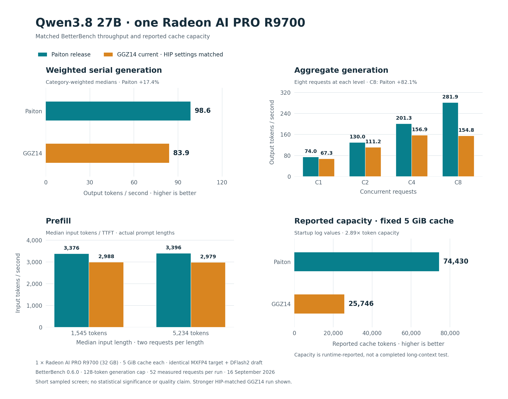
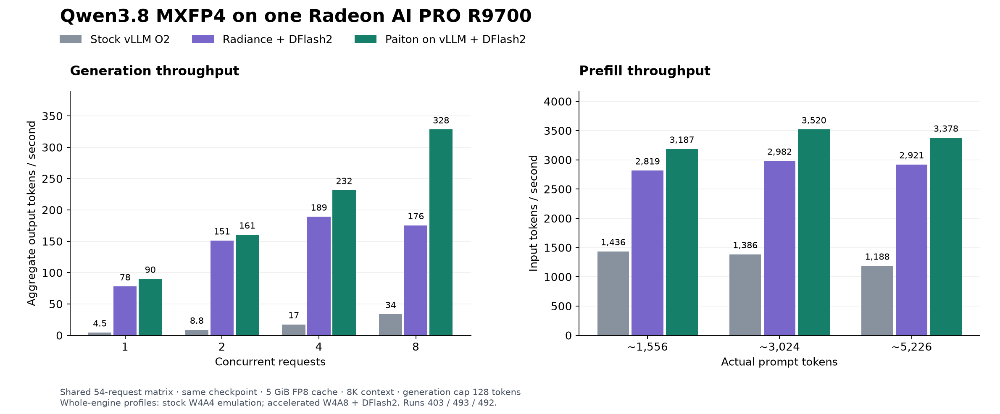
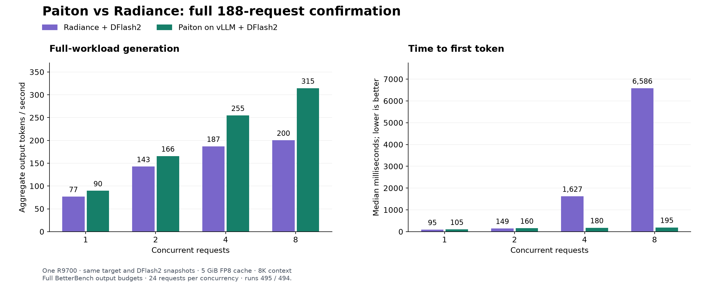

# Qwen3.8 MXFP4 + DFlash2 on regular vLLM

## 64K and 200K images, tool-call fix, and quick benchmark — 17 September 2026

New v1.1.0 images add Qwen XML tool-call parsing and configurable context limits.
The **64K profile** uses a 5 GiB cache and up to eight scheduled requests; the
**200K profile** uses an 8 GiB cache and one active request, with little spare
VRAM on the 32 GB R9700. The original v1.0.0 image remains available.

The 64K image completed a 52-request BetterBench quick run: **304.1 tok/s aggregate
at concurrency eight**, with **67.8 tok/s median per request**. These are short
prompts with a 128-token output cap and thinking disabled. Separate long-context
retrieval and OpenCode tool tests are documented alongside the benchmark.

[New benchmark page, visuals, evidence, and GHCR package links](benchmarks/2026-09-17-agentic-64k/README.md)
· [64K and 200K launch commands](LAUNCH-agentic-v1.1.0.md)
· [Tool calling and context details](SUPPORT.md).

The comparison sections below retain the measurements from the earlier 8K release.

## BetterBench 0.6.0 against current GGZ14 — 16 September 2026

On one Radeon AI PRO R9700, the released Paiton integration delivers **17.45%
higher weighted generation throughput**, **82.13% higher aggregate throughput
at concurrency eight**, and **13–14% faster prefill** than the tested current
GGZ14 implementation. These figures use its stronger repeat with matching HIP
settings, the same AMD MXFP4 target and DFlash2 drafter, and an equal 5 GiB cache
allocation.



[Results, latency tradeoffs, all four runs and downloadable visual reports](benchmarks/2026-09-16-betterbench/README.md)
· [Raw measurements and provenance](benchmarks/2026-09-16-betterbench/provenance.json)
· [Reproduce](benchmarks/2026-09-16-betterbench/REPRODUCE.md).

This is a 128-token quick screen with sampled generation. GGZ retains advantages
in some short-prompt latency and per-request metrics. It is distinct from the
earlier benchmark suites below and from the different NVFP4/two-GPU setup.

## Earlier release benchmark suites

Paiton delivers **22% higher weighted decode throughput**, **57% more throughput
at eight concurrent requests**, and **12.5–17.3% faster prefill** than Radiance +
DFlash2 on the same Radeon AI PRO R9700. Paiton leads all eight task categories
and all four concurrency throughput levels in the full 188-request comparison.

At eight concurrent requests, median time to first token falls from **6.59
seconds to 195 ms**, including queueing. The same 5 GiB cache pool provides
**2.89× the estimated token capacity**, with logs recording eight active requests
for Paiton versus three for Radiance.

Paiton combines native HIP kernels, adapted Radiance techniques, and vLLM's
DFlash2 support. The official vLLM installation stays in place: a model-specific
plugin supplies the native implementation. There is no separate Radiance engine
or DFlash package to install.



The common 54-request matrix includes stock vLLM O2: C8 throughput is
**33.7 / 175.6 / 328.5 tok/s** for stock / Radiance / Paiton respectively. Its
128-token generation cap differs from the longer full preset, reported
separately below.



[Complete three-engine tables, latency, and measurement scope](BENCHMARKS.md).
Radiance retains an approximately 10–11 ms TTFT advantage at one and two
concurrent requests; Paiton's latency advantage appears under concurrent load.

## Run the v1.0.0 benchmark release

[Context overrides, structured tool calls, and coding-agent setup](SUPPORT.md)
cover the reproduced parser mismatch and the local configuration workarounds.
The corrected 64K profile has functional API/client validation separate from the
historical benchmarks.

Release **v1.0.0** is available on GHCR. The launcher pins the qualified image
by digest in [runtime.lock.json](runtime.lock.json).

Use Linux x86-64, Docker, and one Radeon AI PRO R9700 with working AMD GPU device
access. The dedicated image includes the pinned official vLLM 0.28 ROCm runtime,
the Paiton adapter, and all qualified native libraries.

```bash
docker run -d --name paiton-qwen38-mxfp4 \
  --device /dev/kfd --device /dev/dri --group-add video --shm-size 2g \
  -p 127.0.0.1:8000:8000 \
  -v paiton-qwen38-mxfp4-cache:/models/cache \
  ghcr.io/eliovp/paiton-vllm-plugin@sha256:9b2dae214076d35de785e073b31294b033a376b16e6bc1ec1fdada4e54d96c59
```

The first image pull downloads approximately 11.4 GB of runtime layers when
those layers are not already cached. The first start then downloads approximately
21.9 GB of target and draft weights
from their original repositories and verifies the locked file hashes. Later
starts reuse the cache. Follow `docker logs -f paiton-qwen38-mxfp4` until startup
completes, then check `curl --fail http://127.0.0.1:8000/health`.

```bash
curl --fail http://127.0.0.1:8000/v1/chat/completions \
  -H 'Content-Type: application/json' \
  -d '{"model":"Qwen3.8-27B-Quark-AWQ-MXFP4","messages":[{"role":"user","content":"Write a Python function that preserves the first occurrence of each item in a list."}],"temperature":0,"max_tokens":256,"stream":true,"chat_template_kwargs":{"enable_thinking":false}}'
```

No compiler checkout or build step is required. The image starts the ordinary
vLLM OpenAI API server after checkpoint verification.

## Launcher and cached models

From this repository, [serve.py](serve.py) starts the same image and defaults to
verified downloads with a persistent Docker cache volume:

```bash
python3 models/Qwen3.8-MXFP4-DFlash2/serve.py --detach
```

Use `--cache /path/to/cache` for a host cache directory, `--port` for another
local port, and `--name` for a different container name. `--dry-run` prints the
Docker argument list without downloading files or starting a container.

To download and verify the snapshots without accessing the GPU:

```bash
python3 models/Qwen3.8-MXFP4-DFlash2/serve.py --download-only
```

After downloading, `--offline` requires cached or explicitly mounted files.
Existing snapshot directories can be supplied independently; each is mounted
read-only and verified inside the container:

```bash
python3 models/Qwen3.8-MXFP4-DFlash2/serve.py \
  --target /path/to/pinned-target-snapshot \
  --draft /path/to/pinned-draft-snapshot \
  --offline --detach
```

Use one launch example at a time for the same GPU. `docker stop
paiton-qwen38-mxfp4` stops the default serving container; the cache persists.

## Model and v1.0.0 profile

| Setting | Tested configuration |
|---|---|
| Target | `amd/Qwen3.8-27B-Quark-AWQ-MXFP4` |
| Draft | `tcclaviger/Qwen3.8-27B-DFlash2-FP8` |
| Hardware | One Radeon AI PRO R9700, RDNA 4 / `gfx1201`, 32 GB |
| Runtime | Official vLLM 0.28 ROCm image plus the Paiton plugin |
| Input | Text |
| Maximum context | 8,192 total tokens per request |
| Concurrent requests | Up to eight |
| Cache | FP8 KV, explicit 5 GiB pool, prefix caching disabled |
| Prefill chunk | Up to 4,096 tokens |
| Speculation | DFlash2, seven speculative tokens, unpadded drafting |
| Benchmark sampling | Greedy; no requested log probabilities |

Target and draft revisions, file sizes, and SHA256 hashes are pinned in
[checkpoint.lock.json](checkpoint.lock.json). This checkpoint is distinct from
the Qronos and NEO CODER MAX releases; their speeds are not used as model-matched
baselines here. The token-cache capacity estimate does not extend the tested
8,192-token per-request context limit.

The native overlay and manifests are also distributed through
[Hugging Face](https://huggingface.co/EliovpAI/Qwen3.8-27B-Quark-AWQ-MXFP4-DFlash2-Paiton-RDNA4).
The weight files remain in the original model repositories.

## Integration and provenance

The dedicated image installs the model-specific plugin with `--no-deps` onto
the pinned official vLLM image. It uses vLLM's extension interfaces for the
model, loader, linear kernels, attention backend, and worker. It does not replace
the installed vLLM library. The main repository's general installation has a
different historical vLLM pin; use this model's qualified image and profile.

Paiton's native artifacts use HIP and load independently of PyTorch, Triton,
and Radiance. The serving adapter retains vLLM's existing framework dependencies
and upstream DFlash2 scheduling. The compiler and implementation source stay
private; the runtime package contains only the external adapter, allowlisted
native libraries, and runtime metadata.

[Radiance](https://github.com/magiccodingman/vllm-radiance) and
[StillDeadcode/libr4d](https://codeberg.org/StillDeadcode/libr4d) are credited for
the adapted kernel techniques. [Third-party attribution and terms](THIRD_PARTY_NOTICES.md).

The ordinary CLI deployment check passes streaming, eight concurrent requests,
and generation at the 8K context boundary followed by a fresh request.
[Deployment check](deployment-check.json) · [Unchanged-vLLM audit](runtime-audit.json) · [Published-image audit](release-audit.json).

## Reproduce the image context

The image can be rebuilt from the public adapter and the pinned native overlay.
The context preparer verifies an explicit file allowlist; it does not require
the private compiler. Download the companion release with the Hugging Face CLI,
then prepare a new build directory:

```bash
hf download EliovpAI/Qwen3.8-27B-Quark-AWQ-MXFP4-DFlash2-Paiton-RDNA4 \
  --revision v1.0.0 --local-dir qwen38-paiton-runtime
python3 models/Qwen3.8-MXFP4-DFlash2/prepare_image_context.py \
  --overlay qwen38-paiton-runtime/overlay --output qwen38-image-context
docker build -t paiton-qwen38-mxfp4:local qwen38-image-context
```

Use this model's `runtime-pyproject.toml`, copied automatically by the preparer;
the repository-wide package targets other runtime versions. The published
container digest identifies the tested distribution; a local rebuild creates
its own image identity.
