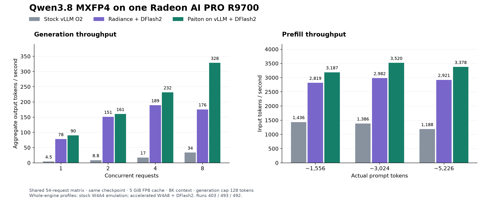
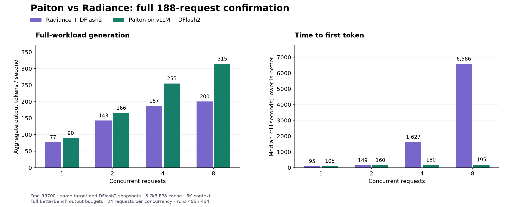

# Qwen3.8 release reference

Start with the [quickstart](README.md#pick-how-to-run-it) to pick the weights and mode and launch the current image.
This page holds detailed measurements, advanced setup and release history.

- [Release notes](#release-notes-5-october-2026) (earlier: [6 October launcher update](#launcher-update-6-october-2026), [4 October](#release-notes-4-october-2026), [3 October](#release-notes-3-october-2026),
  [2 October](#release-notes-2-october-2026), [28 September](#release-notes-28-september-2026))
- [Existing Hugging Face cache](#already-in-the-hugging-face-cache)
- [GPU and memory controls](#gpu-context-and-memory-controls)
- [Long context and prefix caching](#long-context-200k-and-220k)
- [Coding mode (`--mode long-kv4`)](#coding-mode), [RAM and SSD cache tiers (`--extend-cache`)](#cache-tiers),
  [524,288 tokens (`--mode long-512k`)](#mode-long-512k) and
  [system-memory options](#system-memory-and-experimental-options)
- [Vision measurements](#images-and-vision)
- [3-bit weights and quality](#faster-decode-and-prefill-3-bit-w3a4-weights-optional)
- [4-bit KV cache](#more-context-capacity-4-bit-kv-cache)
- [Optional n-gram co-drafting](#faster-agentic-coding-decode-n-gram-co-drafting-opt-in)
- [Benchmark results](#current-benchmark-results)
- [Native serving without DFlash2](#native-serving)
- [Historical releases](#historical-releases-and-comparisons)

The older `run-rocm10.sh` commands on this page choose 3-bit when `PAITON_W3ROT_DIR`
is set and MXFP4 otherwise. The quickstart's `run-mxfp4.sh` and `run-3bit.sh`
select the weight mode explicitly; both use the same launcher and pinned image.

<a id="release-notes-5-october-2026"></a>

### Release notes: 5 October 2026 (image r1, current)

The image `ghcr.io/eliovp/paiton-vllm-plugin:qwen38-rocm10-vllm029-20261005-r1` (`sha256:245c71d54f046f89b74dbfbd4c894003754561e55c9d215a8d3ce65364fb0f80`)
is the 4 October image with a faster start, native long-prompt attention and 4-bit decode kernels, images in the
coding mode and larger cache tiers. Weights, drafter and every mode's limits are unchanged. Update this repository to
get the launcher that selects it; `--dry-run` prints the full Docker command.

- **Faster, reproducible start.** The image carries a seeded compile cache and warms its kernels before it answers:
  `--mode long-kv4` reaches healthy in about 180 s on its first start and in about 120 s on later starts (3-bit, one
  R9700, measured on the same host). The 4 October image needs about 305 s on its first start (it ships no seed) and
  about 150 s with an already warm cache directory. The
  seed also holds the compiled kernels of our validation runs: a compile cache built from scratch compiles a few
  runtime kernels differently, and on the 4 October image (which ships no seed) a cold start can therefore answer a few
  prompts differently from our validated outputs. With this image the first start answers exactly as validated. The start-up log prints one
  `[paiton.cache]` line with what the seed covered.
- **Native kernels, same answers.** The long-prompt attention of `--mode long` and `--mode long-kv4` and the
  4-bit cache's decode kernels are Paiton's own. On the same host, outputs match the 4 October image at the default
  settings: greedy answers, GSM8K texts, 65K-mode answers and long prompts up to 258K tokens. One long coding-mode
  prompt's first token differs between hosts for both images (its compile cache decides a near tie); the paired
  check on long coding prompts shows no accuracy change. First token on a 258K-token prompt: 122.2 s instead of 126.0 s
  (65K: 18.9 instead of 19.7 s); decode speed unchanged within noise.
- **New: images in the coding mode.** `--mode long-kv4 --vision` adds image input to the long-context coding mode:
  496,129 cached tokens with images, 262,144 per request. Images up to 4K are read at full resolution; larger ones
  are downscaled. `--mode long-512k` stays text-only. See [Images and vision](#images-and-vision).
- **Known item:** with the FP8 KV cache (`--mode long --vision`) the model can misread single characters of tiny text
  (about 15 px) in 4K screenshots; the coding mode (`--mode long-kv4 --vision`) reads the same text exactly. Prefer the
  coding mode for screenshots of code.
- **`--vision` modes handle large images more steadily:** images up to 4K (3840 x 2160) are read at full resolution,
  larger ones are downscaled, and memory stays clear of the card's limit (first answer on a 4096² image about 4.6 s
  instead of about 12 s).
- **Cache tiers hold more.** With this image a cached token takes about 24 KB in the RAM or SSD tier (was about
  40 KB). `--extend-cache auto` therefore picks system memory on a 32 GB host (a tier of about 677K tokens; 48 GB
  about 917K, 64 GB about 1.27M; these sizes are computed from the bytes per token, only the 16 GB SSD restores were
  measured), and the SSD on 16 to 24 GB hosts, whose default 64 GiB cap holds about 2.8M tokens.
  The disk tier grows while the server runs; an over-full folder is removed at the next start, and
  `--wipe-disk-cache` clears it by hand. See [Cache tiers](#cache-tiers).
- **Includes the 6 October launcher update** (one GPU by default, the pinned-memory default, the VRAM check before a
  start, the small-RAM-tier warning).
- **Unchanged except the vision caps:** every mode's context, cache and request limits; the MXFP4 and 3-bit weights;
  `--host-cache-gib` and `--disk-cache-dir`.
- **Earlier images** stay runnable with `--image` and keep their behaviour; the 4 October image remains the
  reference for these outputs. See [Run an earlier release](README.md#run-an-earlier-release).

<a id="launcher-update-6-october-2026"></a>

### Launcher update: 6 October 2026 (launcher only)

`git pull` in your checkout gets a launcher update; images, weights and every mode's limits are unchanged.

- **Fixed: `--mode long-kv4` kept the embedding table on the GPU on hosts whose kernel reports the default pinned-memory
  limit as 0** (`/sys/module/ttm/parameters/pages_limit`), so the cache held 451,879 instead of 569,878 tokens and
  `--extend-cache` / `--host-cache-gib` were refused there. The launcher now reads the kernel's default (half the RAM).
- **Fixed: `torch.OutOfMemoryError` at start when VRAM is already in use** (a display on the R9700, or a container that is
  still stopping). Before a real start the launcher reads the selected card's VRAM in use; above 1 GiB it waits up to 30 s
  for a stopping container, then refuses with the amount in use and the `--kv-cache-memory-bytes` that would fit.
  `--ignore-vram-check` skips the check; `--dry-run` never reads the card.
- **One GPU by default.** The server runs on exactly one R9700: the first qualified one, or `--devices N` (`--list-gpus`
  shows the numbers). Hosts with an integrated GPU no longer expose it to the container. A `HIP_VISIBLE_DEVICES` /
  `ROCR_VISIBLE_DEVICES` environment still applies as before.
- **Warning for a RAM tier smaller than the GPU cache** (`--extend-cache ram` or `--host-cache-gib` on a 16 to 24 GB host):
  such a tier keeps a copy of what the GPU already holds, so it rarely helps with several large documents in turn;
  `--extend-cache disk` keeps them across the session.
- **Unchanged:** outputs, modes and limits; `--dry-run` prints the same Docker command as before except for the three
  GPU-selection variables and, on hosts affected by the pinned-memory fix, the restored embedding placement and cache
  size.

<a id="release-notes-4-october-2026"></a>

### Release notes: 4 October 2026 (image r1)

The image `ghcr.io/eliovp/paiton-vllm-plugin:qwen38-rocm10-vllm029-20261004-r1` (`sha256:6a97d65fda17c1c48b36d3423c6f3709bd65a3849227e45a8a24a552d4c81b9d`)
is the 3 October image with one fix to the prefix-cache connector. Weights, drafter and the serving settings are
unchanged. Update this repository to get the launcher that selects it; `--dry-run` prints the full Docker command.

- **Fixed: the RAM and SSD cache tiers with the 4-bit cache.** With the 4-bit cache, a hit from system RAM or disk
  now always resumes on a recurrent-state block. That is why the 3 October image refused these tiers in
  `--mode long-kv4`. Every reopened document gives output bit-identical to the same document served from the GPU
  cache, at every length tested (32K to about 258K tokens). A hit the server cannot place is read again instead.
- **New, opt-in: `--extend-cache [auto|ram|disk]`** for `--mode long-kv4`. It keeps prefix-cache blocks that leave
  the GPU in system RAM or on an NVMe/SSD and sizes the tiers for the host. On a 16 GB host with a SATA SSD, after a
  full server restart, a 130K-token document came back in 6.8 s instead of 46.9 s cold, a 200K-token document in
  9.0 s instead of 86.4 s, both with the same output as a fresh read. See [Cache tiers](#cache-tiers).
- **Launcher: memory checks for the tiers.** On a 16 GB host it refuses a RAM tier with the embedding table in
  system RAM (that needs 32 GB) and moves the table to the GPU instead. With a tier it refuses to start when free
  memory is short, naming the shortfall, and warns when memory is tight. With a disk tier the container gets its own
  `/dev/shm`, so a crash never leaves the tier behind.
- **Unchanged:** without a cache tier, outputs are identical to the 3 October image. `--mode 65k`, `--mode long`,
  `--mode long-kv4`, `--mode long-512k`, `--vision` and the MXFP4 weights produce the same serving command as there;
  only the image differs. `--host-cache-gib` and `--disk-cache-dir` still work.
- **Earlier images** stay runnable with `--image` and keep their behaviour. The 3 October image and older refuse the
  4-bit cache tiers, whether given by tag or by digest; see
  [Run an earlier release](README.md#run-an-earlier-release).

<a id="release-notes-3-october-2026"></a>

### Release notes: 3 October 2026 (image r1)

The image `ghcr.io/eliovp/paiton-vllm-plugin:qwen38-rocm10-vllm029-20261003-r1` (`sha256:fb71b59eb29f3341dd10e9972920e75073a03fefc7bf6d2f2e1966b91a730f53`)
is the 2 October image (r1s) with the changes below. Weights, drafter and the other serving
settings are unchanged. Update this repository to get the launcher that selects it; `--dry-run` prints the full
Docker command.

- **`--mode long-kv4` is now the coding mode.** It adds prefix caching and keeps the input embedding table
  (2.4 GiB) in pinned system RAM, which gives the shared 4-bit cache 569,878 tokens instead of 458,922: two
  full-length requests at once. A coding conversation growing to 253K tokens and three agents sharing a repository
  ran 6.1 and 5.9 times faster end to end. Decode is unchanged; reading a new long prompt is about 3 % slower (7 to 13 %
  for short prompts). Without pinnable system RAM it keeps the table on the GPU (451,879 tokens). See
  [Coding mode](#coding-mode).
- **New, experimental: `--mode long-512k`.** Up to 524,288 tokens per request with the model's official
  long-context scaling (applied to every request in this mode), prefix caching and a 594,290-token cache. Opt-in;
  see [524,288 tokens](#mode-long-512k).
- **Fixed: prefix-cache hits in the 4-bit long mode.** A request resumed from the cache could continue from the
  recurrent state of another block, which is why the 2 October image runs `--mode long-kv4` without prefix caching.
  A new question about a 258K-token document now gives the same output from the cache (2.7 s) as from a cold read
  (134 s).
- **Fixed, `--mode long-512k` only: the long-context scaling of the multimodal position encoding.** vLLM computed
  the scaling's correction range for four times the original context, so part of the rotary frequencies differed
  from the reference implementation. Only `--mode long-512k`, the one mode that applies this scaling, is
  affected.
- **New options:** `--no-system-memory-weights`; experimental `--system-memory-weights` in `--mode long`,
  `--host-cache-gib` and `--disk-cache-dir` (both `--mode long` only) and `--gdn-state`. See
  [System memory and experimental options](#system-memory-and-experimental-options).
- **Unchanged:** `--mode 65k`, `--mode long`, `--vision` and the MXFP4 weights produce the same serving command as
  on the 2 October image; only the image differs. `--context 262144 --kv-cache kv4` keeps the 2 October form of
  `--mode long-kv4` (no prefix caching, embedding table on the GPU).
- **Earlier images** stay runnable with `--image` and keep their behaviour; see
  [Run an earlier release](README.md#run-an-earlier-release).

<a id="release-notes-2-october-2026"></a>

### Release notes: 2 October 2026 (image r1)

The image `ghcr.io/eliovp/paiton-vllm-plugin:qwen38-rocm10-vllm029-20261002-r1`
(`sha256:82a24a1926bc01a134b106401390650b9e0ddb0aa8cf6a613ba3a615ce46b840`) is the 29 September r2 image with the
changes below. Weights, drafter and the other serving settings are unchanged. Its rebuild with the same runtime,
`qwen38-rocm10-vllm029-20261002-r1s` (`sha256:a1c1025052f84a009428709bfe7e9431281ab5d5c0f723a49d79eecafe519dad`), is
the reference to run with `--image` ([how](README.md#run-an-earlier-release)); `--dry-run` prints the full Docker
command.

- **New: `--mode 65k|long|long-kv4`.** One option per serving mode: `65k` (the default), `long` (the same as
  `--context 262144`: FP8 cache with prefix caching) and `long-kv4` (the same as `--context 262144 --kv-cache kv4`).
  Without `--context`, `--mode long` picks 200,000 tokens with the MXFP4 weights and 245,000 with `--vision`, the
  same as those `--context` values. The launcher refuses flags that contradict the chosen mode; the old flag
  spellings keep working and are checked the same way.
- **New: a 4-bit KV page format with its own attention decode,** used by the 65K mode with the 3-bit weights and by
  `--mode long-kv4`. One decode step of an attention layer takes 14 % less time than with the previous 4-bit kernel
  at 200K tokens and 12 % less at the 65K mode's eight-request shape; in the 65K mode its accuracy equals the FP8
  cache. See [4-bit KV cache](#more-context-capacity-4-bit-kv-cache).
- **New: `--mode long-kv4`,** the long-context mode (still up to 262,144 tokens per request) with a shared 4-bit
  cache of 458,922 tokens instead of 281,665 (1.63×), without prefix caching: every request re-reads its full
  prompt. See
  [the 4-bit cache in the long-context mode](#the-4-bit-cache-in-the-long-context-mode).
- **Fixed: the 65K mode with the 3-bit weights under eight concurrent requests.** On the 29 September image the
  memory allocator could grow past the card's free VRAM, and the driver then moved GPU memory to system RAM. The
  launcher now caps the allocator and the image leaves 1 GiB of VRAM unclaimed after warm-up (BetterBench:
  179.7 tok/s single-stream, 488.5 tok/s with eight requests, 48/48 requests completed at each concurrency level,
  peak 30.85 GiB).
- **On the 29 September r2 image** (`--image`), the 4-bit long-context mode is refused: `--mode long-kv4`, and
  `--kv-cache kv4` with `--profile chat` or with a `--context` above 65,536 (with or without
  `--prefix-caching off`). With an explicit `--profile release` or `desktop`, `--kv-cache kv4` stays limited to
  200,000 tokens there.

<a id="release-notes-28-september-2026"></a>

### Release notes: 28 September 2026 (image r2 of 29 September)

The image `ghcr.io/eliovp/paiton-vllm-plugin:qwen38-rocm10-vllm029-20260929-r2`
(`sha256:1195f31329966b3dc4e8e2d17327d339827b3d2b09165f9969b053a6fc2db045`) is the 26 September 65K image with the changes below. Weights, drafter and the
other serving settings are unchanged. Update this repository to get the launcher that selects it.

- **Fixed in r2 (29 September): DFlash2 draft head built from an uninitialised tensor.** The
  drafter has no `lm_head` of its own; the target's is shared in after the drafter's weights
  load. The int2 draft head decided at load time whether that tensor was still empty and, if
  the memory it got happened to hold old data, quantised garbage. Text stayed correct (the
  target is untouched), but DFlash2 then accepted 0% of its draft tokens and decode ran at
  about a fifth of the published speed. Our test machines always received zeroed memory and
  never showed it; a user on Unraid did, and reported it with the diagnosis. The draft head is
  now always built on first use from the real head. The 20, 24, 26 and 28 September (r1)
  images all carry the affected file; on them, run the container with
  `-e RADIANCE_FAST_DRAFT=0` (the stock bf16 draft head, about 10% slower decode than the int2
  head) or update.
- **New: one image for both modes.** `run-rocm10.sh` starts the 65K mode. A `--context` above 65,536, for
  example `--context 200000`, starts the long-context mode on the same image: one request, prefix caching
  and an 8 GiB FP8 KV cache (the settings of the earlier 200K `chat` profile). `run-rocm10-65k.sh` and
  `run-rocm10-200k.sh` still work; the 200K script now uses this image instead of the 18 September 200K
  image.
- **New: image input.** `--vision` serves the checkpoint's vision encoder in the 65K mode; see
  [Images and vision](#images-and-vision).
- **New: 4-bit KV cache** with the 3-bit weights in the 65K mode, on by default; see
  [4-bit KV cache](#more-context-capacity-4-bit-kv-cache). New launcher option `--kv-cache auto|kv4|fp8`.
- **Fixed: engine stop under concurrent load.** With three to five requests at once, and rarely with one
  very short prompt, the 26 September image could stop with
  `RuntimeError: Paiton GDN norm nonfinite/arithmetic error: 1`, and requests failed until a restart.
  Unused padding rows in some GPU steps held uninitialized memory, and a safety check in the
  recurrent-layer norm stopped the engine on them. The image now zeroes these rows: a soak test of 10,002
  such steps ran without errors, and outputs are unchanged.
- **If you stay on the 26 September image,** run its container with `-e RADIANCE_DYNAMIC_WIDTH=0`. In our
  runs this avoided more than 99% of these steps. The launcher does not pass it; `--dry-run` prints the full
  Docker command.
- **Unchanged:** prefill and single-request decode speed.

### Already in the Hugging Face cache

If you previously ran `hf download` without `--local-dir`, select the Hub cache
that contains both pinned snapshots. The following **65K Docker command** mounts
the entire cache read-only and selects the snapshots inside it, preserving their
links to `blobs/`. It starts the 65K mode with MXFP4 weights and
the same settings as the launcher; only the weight paths differ. The three
`PAITON_W3_*=0` variables switch off the image's 3-bit path and the two
`PAITON_KV4*=0` variables its 4-bit KV cache, as the launcher does without
`PAITON_W3ROT_DIR`. For the 3-bit weights, the long-context mode or `--vision`, use
the launcher instead. It cannot use Hub-cache snapshots: it needs standalone target
and draft folders ([First download](README.md#model-weights-and-existing-downloads) or
[Already in a local folder](README.md#model-weights-and-existing-downloads)), plus the
[3-bit folder](README.md#optional-3-bit-w3a4-weights) for the 3-bit weights.

For a cache on another drive, replace the first export with
`export HF_HUB_CACHE="/absolute/path/to/your/hub-cache"`.

```bash
export HF_HUB_CACHE="${HF_HUB_CACHE:-${HUGGINGFACE_HUB_CACHE:-${HF_HOME:-${XDG_CACHE_HOME:-$HOME/.cache}/huggingface}/hub}}"
export PAITON_CACHE_DIR="$PWD/runtime-cache/qwen38-rocm10-20261004"
mkdir -p "$PAITON_CACHE_DIR"

docker run --rm --name paiton-qwen38-65k-cached --network host \
  --device /dev/kfd --device /dev/dri --group-add video --ipc=host \
  --mount "type=bind,src=$HF_HUB_CACHE,dst=/hf-hub,readonly" \
  --mount "type=bind,src=$PAITON_CACHE_DIR,dst=/cache" \
  -e HF_HUB_OFFLINE=1 \
  -e PAITON_W3_DECODE=0 -e PAITON_W3_PREFILL=0 -e PAITON_W3_A4=0 \
  -e PAITON_KV4=0 -e PAITON_KV4_CAPACITY=0 \
  -e ROCR_VISIBLE_DEVICES -e HIP_VISIBLE_DEVICES -e CUDA_VISIBLE_DEVICES \
  ghcr.io/eliovp/paiton-vllm-plugin:qwen38-rocm10-vllm029-20261004-r1@sha256:6a97d65fda17c1c48b36d3423c6f3709bd65a3849227e45a8a24a552d4c81b9d \
  serve /hf-hub/models--unsloth--Qwen3.8-27B-NVFP4/snapshots/f0b7c9e722f5565102fff8481c99e4d86ae099c7 \
  --tokenizer /hf-hub/models--unsloth--Qwen3.8-27B-NVFP4/snapshots/f0b7c9e722f5565102fff8481c99e4d86ae099c7 \
  --served-model-name Qwen3.8 \
  --host 127.0.0.1 \
  --port 18982 \
  --tensor-parallel-size 1 \
  --dtype bfloat16 \
  --max-model-len 65536 \
  --max-num-seqs 8 \
  --max-num-batched-tokens 4096 \
  --kv-cache-dtype fp8 \
  --kv-cache-memory-bytes 6535819798 \
  --gpu-memory-utilization 0.98 \
  --no-enable-prefix-caching \
  --enable-chunked-prefill \
  --language-model-only \
  --safetensors-load-strategy lazy \
  --attention-backend R4D \
  --compilation-config '{"cudagraph_capture_sizes": [1, 2, 4, 8, 16, 24, 32, 40, 48, 56, 64], "pass_config": {"fuse_norm_quant": true, "fuse_act_quant": true}}' \
  --speculative-config '{"method":"dflash","model":"/hf-hub/models--tcclaviger--Qwen3.8-27B-DFlash2-FP8/snapshots/ee0cb26a8279b7910cc28d82a8a3e15e4728d56f","num_speculative_tokens":7,"draft_tensor_parallel_size":1,"attention_backend":"TRITON_ATTN","max_model_len":65536,"disable_padded_drafter_batch":true,"draft_sample_method":"greedy"}' \
  --mamba-cache-mode align \
  --mamba-cache-dtype bfloat16 \
  --mamba-ssm-cache-dtype float16 \
  --no-async-scheduling \
  --enable-auto-tool-choice \
  --tool-call-parser qwen3_coder \
  --reasoning-parser qwen3 \
  --override-generation-config '{"temperature": 0.7, "top_p": 0.95, "top_k": 20}' \
  --seed 42
```

Both snapshots must be complete; a different cached revision is not selected
implicitly. If one is missing, run the corresponding pinned `hf download`
command from [First download](README.md#model-weights-and-existing-downloads) **without `--local-dir`** to fill
your configured Hub cache, then retry this command. Do not mount only a linked
snapshot at `/models/target` or `/models/draft`: that can break its blob links.
[Cache layout and path guide](../../docs/MODEL_WEIGHTS.md).

## GPU, context, and memory controls

Context is **not compiled into the image**: `--context` sets both the target and
DFlash draft limits at startup, and above 65,536 tokens it selects the long-context
mode. The limit includes input and generated tokens. A larger
limit still requires sufficient cache and VRAM; it does not guarantee useful
model quality at that length.
The checkpoint's configured ceiling is 262,144 tokens: the 3-bit weights serve it
(`--mode long`); with the MXFP4 weights the largest serving limit tested here is **220,000**.
`--mode long-512k` (experimental, 3-bit weights) goes to 524,288 with the model's official long-context scaling;
see [below](#mode-long-512k).

The launcher exposes `/dev/kfd` and all of `/dev/dri`, adds the `video` group,
and uses host IPC (with a disk cache tier, a private IPC namespace; see [Cache tiers](#cache-tiers)).
Select the GPU with your usual ROCm environment variables.
For example, if the R9700 is ROCm GPU 1:

```bash
export ROCR_VISIBLE_DEVICES=1
bash models/Qwen3.8-MXFP4-DFlash2/run-rocm10.sh
```

By default the launcher runs the server on exactly one GPU: the first qualified R9700 it finds, or the one given with
`--devices N` (`--list-gpus` prints the numbers, render devices and PCI addresses). A `HIP_VISIBLE_DEVICES` /
`ROCR_VISIBLE_DEVICES` environment is forwarded as before and replaces the automatic choice (not together with
`--devices`).

The launcher forwards your `ROCR_VISIBLE_DEVICES`, `HIP_VISIBLE_DEVICES` and
`CUDA_VISIBLE_DEVICES` values unchanged. If a variable is unset on the host, it
is also unset in the container, overriding the image's default. The launcher
does not force a GPU index or UUID. An explicitly empty mask remains empty;
it does not mean "show all GPUs".

On Linux, `ROCR_VISIBLE_DEVICES` also filters ROCr tools such as `rocminfo`;
`HIP_VISIBLE_DEVICES` applies at the HIP layer. If you set both, HIP indices refer
to the GPUs remaining after the ROCr filter. Check any existing exports before
launching: setting both variables to `1` does not necessarily select the second
physical card. Leave unused variables unset rather than assigning empty strings.
These controls do not make unsupported GPU architectures compatible with this image.

For a GPU shared with a desktop, start with the smaller preset:

```bash
bash models/Qwen3.8-MXFP4-DFlash2/run-rocm10.sh \
  --profile desktop
```

This selects 32,768 tokens, one scheduled request, 1,024-token prefill chunks,
smaller graph captures, and a 2 GiB KV allocation. It is a starting point
for sharing VRAM, not a guarantee against memory exhaustion. The unchanged
benchmark presets reserve a fixed KV pool and target a dedicated GPU.

Customize the limits without rebuilding or downloading another image:

```bash
bash models/Qwen3.8-MXFP4-DFlash2/run-rocm10.sh \
  --profile desktop --context 16384
```

Setting memory utilization switches to automatic KV sizing unless you explicitly
provide `--kv-cache-memory-bytes`. Lowering context alone does **not** reduce a
fixed KV allocation. `--kv-cache-memory-bytes auto` also enables automatic sizing.
Automatic profiling can leave insufficient cache for the requested context in
this runtime; startup reports the required and available cache sizes.
Use `--dry-run` to inspect the complete Docker command, or `--help` for all options.
Customized settings are separate from the benchmark configuration below.

With the 3-bit weights, the 65K mode gives most of the memory they free to the KV
cache: 8,859,648,000 bytes with the default 4-bit cache (393,216 tokens in vLLM's
startup log) or 9,381,235,631 bytes (250,578 tokens) with `--kv-cache fp8`,
against 6,535,819,798 bytes (174,634 tokens) for MXFP4. Under full load, peak VRAM
was 31.8 GiB with the 4-bit cache and 31.6 GiB with the FP8 cache, with no
out-of-memory errors. An explicit `--kv-cache-memory-bytes` or
`--gpu-memory-utilization`, `--vision`, the `desktop` profile and the long-context
mode use their own budgets.

<a id="long-context-200k-and-220k"></a>
### Long context: up to 262K on the 3-bit weights, 200K and 220K with MXFP4

Any `--context` above 65,536 starts the long-context mode on the **same image**:

```bash
# 3-bit weights: the checkpoint's full 262,144-token context, eight requests, image input allowed
bash models/Qwen3.8-MXFP4-DFlash2/run-3bit.sh --mode long        # the same as --context 262144

# 3-bit weights, coding mode: the same 262,144 tokens per request, a 2x larger shared 4-bit cache, prefix caching
bash models/Qwen3.8-MXFP4-DFlash2/run-3bit.sh --mode long-kv4

# the coding mode with more prefix cache in system RAM or on an NVMe/SSD (opt-in)
bash models/Qwen3.8-MXFP4-DFlash2/run-3bit.sh --mode long-kv4 --extend-cache

# 3-bit weights, experimental: up to 524,288 tokens per request (long-context scaling on every request)
bash models/Qwen3.8-MXFP4-DFlash2/run-3bit.sh --mode long-512k

# MXFP4 weights: one conversation of up to 200,000 tokens (220,000 is the largest tested)
bash models/Qwen3.8-MXFP4-DFlash2/run-mxfp4.sh --mode long       # the same as --context 200000
```

With the **3-bit weights**, `--mode long` runs the release engine shape: up to
eight scheduled requests, a 4,096-token prefill budget, the release graph set, an
FP8 KV pool of 10.2 GB (281,665 cached tokens, so one full-context conversation
plus short concurrent requests), prefix caching, and thinking disabled
(`--mode long-kv4`: a 4-bit pool with prefix caching and the embedding table in system RAM, see
[below](#coding-mode)). With
**MXFP4** it keeps the one-request configuration measured on 28 September (8 GiB FP8
pool, 1,024-token prefill chunks); its pool holds 231,067 tokens, so the launcher
refuses `--context` above 220,000 with MXFP4 and names the 3-bit weights. Both
apply the memory-allocation setting this configuration needs and leave little spare
VRAM: select a dedicated R9700 rather than a card driving a busy desktop.
`run-rocm10-200k.sh` and `--profile chat` start the long-context mode with 200,000 tokens (the 3-bit weights then
serve 200,000, not 262,144; use `--mode long`). `run-rocm10-200k.sh` names its container `paiton-qwen38-200k`.

Measured on one R9700 with the 3-bit weights, 1 October (fresh processes, `--mode long`, the same as `--context 262144`):

| | 198,989-token prompt | 257,992-token prompt |
|---|---:|---:|
| New prompt, time to first token | 85 s | 126 s |
| Identical prompt reused (cached tokens) | 1.2 s (198,000) | 1.7 s (256,960) |
| Follow-up turn on the cached prompt | 1.4 s to first token, 78 tok/s | 1.7 s, 76 tok/s |
| Long answer at this depth (650–700 tokens) | 73 tok/s | 72 tok/s |

All planted facts were found in every prompt (near 5%, 50% and 94% of the 199K
prompts; 4%, 38% and 73% of the 258K ones). Plain and streamed tool calls, an
over-limit request (258,000 input plus 6,000 output, rejected with HTTP 400) and a
normal request after it all passed. The 4,096-token prefill budget is what shortens
the first token: on the same image, alternating fresh processes with the previous
1,024 budget measured 50.7 / 94.2 / 139.2 s against 45.8 / 85.8 / 126.3 s at 128K /
199K / 258K input tokens (−9 to −10 %), with every planted fact found in both.

Repetition: five distinct full-context prompts in a row (each evicting the previous one's
cache), each followed by its cached repeat and seven concurrent short requests, measured
125.7 to 126.1 s cold, 1.67 to 1.69 s cached and no errors or preemptions in any cycle,
with idle VRAM flat after the first cycle.

Concurrency in this mode: eight 32K-token requests and four 61K-token requests
submitted at once all completed without errors or preemptions. Requests are
prefilled one after another, so their first tokens arrive staggered (9 to 76 s
for eight 32K prompts). While a cold full-context prompt is being processed, other
requests wait for it by default (126 s in the measurement). Add
`--long-prefill-threshold 2048` to serve short requests within seconds beside a
long prompt; the long prompt then takes about 16% longer to its first token
(146 s instead of 126 s at 258K). The 281,665-token pool holds one full-length
conversation, so concurrent questions about the same ~257K-token document are
effectively handled one at a time: serve one long document at a time.

The 65K mode does not use prefix caching (APC), so zero cache hits there are
expected. The persistent disk cache used during startup is separate from the
in-memory conversation prefix cache.

`--prefix-caching on` enables the experimental APC configuration and selects the
compatible recurrent-state settings. This changes memory requirements; do not
assume the 65K mode's fixed cache budget remains sufficient. Use `--mode long`
for the complete configuration. Cache hits require an
unchanged token prefix that is still resident. They reduce repeated prompt work,
not the cost of generating each new token.

`--mode long`, `--mode long-kv4` and `--mode long-512k` report cached tokens in
`usage.prompt_tokens_details.cached_tokens` (`--mode long-kv4` on the 2 October image has no prefix caching and
reports none).
Streaming clients must also request `"stream_options":{"include_usage":true}`
to receive usage in the stream. Server-side cache counters are available at
`http://127.0.0.1:18982/metrics`.

These retrieval checks are not a quality evaluation; accuracy at a 257K-token context
is measured below. Repetition
penalties and sampling settings belong in each client's API requests. Report the
prompt, settings and server logs when diagnosing loops; a sampling workaround is
not a general fix.

In the 65K mode, the model's template enables thinking when the client omits that
setting; the long-context mode and our benchmarks disable it. Use `--thinking off` to
set the server default, or send
`"chat_template_kwargs":{"enable_thinking":false}` in each request.

**Accuracy at a 257K-token context.** The same three suites we use for every
quantisation decision, with each question placed after a 257,000-token
background document (a 128K-section archive repeated and shuffled; the document
is cached once, every question is a new request that reads all of it), served by
the long-context mode on the 3-bit weights with the FP8 cache, greedy decoding,
thinking off, one request at a time. Reference: the same model and weights at
short context (September 3-bit run), paired per item; Δ in points with a 95%
interval:

| Benchmark | 3-bit, short context | 3-bit, after 257K tokens | Δ [95% CI] |
|---|---:|---:|---:|
| GSM8K 5-shot (1,319) | 95.30 | 95.83 | +0.53 [−0.30, +1.36] |
| HumanEval pass@1 (164) | 93.90 | 91.46 | −2.44 [−6.20, +1.32] |
| MMLU-Pro subset, 0-shot (14 × 100) | 59.71 | 60.29 | +0.57 [−1.30, +2.44] |

With `--vision` (an image in the request after a 238,000-token document, the
smaller 500-question GSM8K sample and a 14 × 50 MMLU-Pro subset): GSM8K 95.40,
HumanEval 93.29, MMLU-Pro 62.00. We read all of this as no measurable loss from
the context length itself: the differences are within the paired intervals, and
the HumanEval change (4 problems) is not significant at this sample size. The
MXFP4 weights score 95.68 / 95.12 / 62.57 on the same suites; the gap to them is
the 3-bit weights' known cost, not the long context.

<a id="the-4-bit-cache-in-the-long-context-mode"></a><a id="coding-mode"></a>

#### Coding mode: `--mode long-kv4`

`run-3bit.sh --mode long-kv4` serves up to 262,144 tokens per request and eight requests, with the long-context
mode's 4,096-token prefill budget and allocator cap and the attention cache in the
[4-bit format](#more-context-capacity-4-bit-kv-cache). On the 3 October image it adds:

- **Prefix caching for long conversations.** The model's Gated DeltaNet layers carry a recurrent state that a cache
  hit resumes from. With a speculative drafter, vLLM keeps that state at every 1,600-token block of a cached prompt,
  several cache blocks each, so one long prompt can push every other document out of the cache. This mode keeps it
  every 32,000 tokens plus one block before each prompt's end, where the next turn of the same conversation resumes.
  In our 20-turn coding session this found the same cache hits as keeping every state.
- **The embedding table in system RAM.** The 2.4 GiB input embedding moves into one pinned system-memory buffer
  that the GPU reads directly (a few rows per step), and the freed VRAM goes to the KV cache: 569,878 tokens, 2.17
  times a full-length request. Two 261,000-token requests ran together without preemption. Decode speed is
  unchanged (BetterBench −0.5 %).

Measured on one R9700, 3 October: [capacity, speed, coding workloads and accuracy](README.md#coding-mode-results).
A new question about a 258K-token document already read took 2.7 s instead of 134 s, with the same output as a cold
read, and repeated prompts of 16K to 131K tokens came back from the cache in 1.0 to 2.4 s. Over 60 positions of a
long text, answers from the cache predict the text like a cold read (log-likelihood difference +0.008 nats per
token, 95 % interval −0.055 to +0.083; the same top token at 59 of 60 positions). Over five 131K-token documents
the 4-bit cache is within ±0.007 nats per token of the FP8 cache in every position range (both measured on
pre-release builds of this configuration).

**Without pinnable system RAM.** The launcher pins the table only where the host allows 2.4 GiB: total RAM less
about 11.75 GiB (the server's own memory and a 7 GiB reserve), at most the GPU driver's pinned-memory (TTM) limit
less 0.5 GiB, so 16 GB of RAM is enough
(`PAITON_HOST_PIN_LIMIT_GIB` overrides the limit for a host whose memory is known to be free). Otherwise it keeps
the table on the GPU, the cache holds 451,879 tokens (one full-length request plus short ones), prefix caching stays
on, and the launcher prints one note. `--no-system-memory-weights` selects this form on purpose. With less than
6 GiB of system memory available at launch, the launcher warns: the server and the pinned table need about that
much.

**What it gives up.**

- **Reading a new prompt is slower.** With prefix caching a prefill step ends where a later request can resume
  from the cache. On the 3 October image cold prefill is 3,641 / 3,856 / 3,769 / 3,824 / 3,536 tok/s at
  2K / 8K / 16K / 32K / 64K, against 4,167 / 4,165 / 4,102 / 3,954 / 3,633 on the 2 October image: about 3 % slower
  for long prompts and 7 to 13 % for short ones.
- **Only repeats are fast.** A new 258K-token document still takes about 2 minutes to read. When the cache is full,
  the least recently used prefixes are dropped, and reading them again costs a full read, unless
  [`--extend-cache`](#cache-tiers) keeps them in system RAM or on an SSD.
- **2.4 GiB of system RAM** stays pinned while the server runs.
- **No images:** `--vision` is refused; use `--mode long --vision` (up to 245,000 tokens).
- **3-bit weights only:** the 4-bit cache is qualified with them; MXFP4 is refused.

**On earlier images.** The 3 October image (`--image`) runs this mode as described here, but refuses the RAM and
SSD cache tiers (`--extend-cache`, `--host-cache-gib`). The 2 October image runs the previous form of the mode: no prefix caching, the
table on the GPU and a 458,922-token cache (1.63 times `--mode long`'s 281,665). Every request re-reads its full
prompt, including the earlier turns of its conversation: a repeated 32K-token prompt took 10.2 s instead of 2.9 s
from the FP8 cache, a 258K-token prompt about 2 minutes every time. An explicit `--prefix-caching on` is refused
there, and `--context 262144 --kv-cache kv4` starts the same form on the current and the 2 October images. Its
BetterBench and accuracy are the "2 October image" columns of the [quickstart's tables](README.md#coding-mode-results)
(peak VRAM 30.92 GiB). The 29 September image refuses both spellings.

<a id="cache-tiers"></a>

#### RAM and SSD cache tiers: `--extend-cache`

`--extend-cache [auto|ram|disk]` (`--mode long-kv4` only, opt-in) keeps prefix-cache blocks that leave the GPU in
system RAM, or on an NVMe/SSD behind a small RAM staging tier, and restores them on the next hit instead of reading
the document again. It needs the 4 October image: with the 4-bit cache, a hit from RAM or disk must resume on a
recurrent-state block, and this image's prefix-cache connector makes sure it does.

| Choice | Where the cache goes | Sized by the launcher |
| --- | --- | --- |
| `auto` (also the flag alone) | System RAM when a RAM tier would hold at least 1.25 times the GPU cache's tokens; otherwise the NVMe/SSD folder | the tier, the embedding table's placement and the disk cap, from the host's RAM and free space |
| `ram` | System RAM | the largest tier the host can pin |
| `disk` | `PAITON_CACHE_DIR/kv-disk`, or `--disk-cache-dir DIR`, on NVMe/SSD, behind a RAM staging tier (4 GiB on a 16 GB host, 4.5 GiB from 24 GB) | up to 64 GiB or a quarter of the free space, whichever is smaller |

One `Note: --extend-cache …` line at start states the choice, the GPU cache, the tier and disk capacities and the
largest document a disk restore covers. What `auto` picks for each host size is in the
[quickstart](README.md#extend-cache).

**Measured** on a 16 GB host with a SATA SSD, `--extend-cache` (auto: 4 GiB staging, the embedding table on the
GPU), after a full server restart: a 130K-token document came back in 6.8 s instead of 46.9 s cold, a 200K-token
document in 9.0 s instead of 86.4 s, both identical to a fresh read. NVMe should be faster; we have not measured it.

- **Correctness.** Every reopened document gives output bit-identical to the same document served from the GPU
  cache, at every length tested (32K to about 258K tokens). A safety fallback recomputes any hit it cannot place.
  Without a cache tier, outputs are identical to the 3 October image.
- **The RAM tier copies the GPU cache.** It keeps a copy of what the GPU cache holds, so the reusable cache is about
  the size of the larger of the two, not their sum; RAM adds capacity only when its tier is bigger than the GPU
  cache. A RAM tier of N GiB restores a recently read document of up to about N × 55K tokens (4 GiB: about
  220K); with several large documents competing, older ones are recomputed, correctly, just not faster. With
  `--host-cache-gib` and `--mode long` (FP8 cache) the limit per GiB is lower, since that cache takes more bytes per
  token.
- **The disk tier.** One folder per image, weights and cache format, kept across restarts. It stores about 40 KB per
  newly read prompt token (64 GiB holds about 1.7M new tokens); tokens served from the cache are not stored again.
  The cap is checked at start and the folder can grow past it while the server runs; a folder over its cap is
  removed at the next start. Every restore passes through the RAM staging tier: documents up to about 220K tokens
  with 4 GiB of staging, about 250K with 4.5 GiB. Spinning disks are refused (`--disk-cache-allow-hdd` overrides
  that, with slow restores).
- **System memory.** The tier is pinned system memory. On a 16 GB host the launcher refuses a RAM tier with the
  embedding table in system RAM (that needs 32 GB) and, with a tier, moves the table to the GPU (GPU cache 451,879
  tokens). It refuses to start when available memory is short, naming the shortfall, and warns when it is tight.
- **Running the image by hand with the disk tier:** give the container `--ipc private --shm-size <tier + 1 GiB>`
  (for example `--shm-size 5g` with 4 GiB of staging). The disk tier keeps its RAM part in `/dev/shm`; in the host's
  IPC namespace a crashed server would leave it there. The launcher does this itself, so a crash never leaves the
  tier behind.
- **Setting the tiers by hand:** `--host-cache-gib` and `--disk-cache-dir` still work; see
  [System memory and experimental options](#system-memory-and-experimental-options). `--extend-cache` sets them
  itself and refuses `--host-cache-gib`.
- **Refused:** in `--mode long`, `--mode long-512k` and the 65,536-token mode, with the MXFP4 weights, and on the
  3 October image and older (given by tag or by digest).

<a id="mode-long-512k"></a>

#### 524,288 tokens: `--mode long-512k` (experimental)

`run-3bit.sh --mode long-512k` serves up to 524,288 tokens per request, twice the checkpoint's native 262,144, with
everything else as in the coding mode:

- **The model's official long-context scaling**, the model card's route past 262,144 tokens: the launcher extends
  the position range to 524,288 tokens (twice the native length) for every request in this mode; `--dry-run`
  prints the exact setting. Only the 16 full-attention layers use rotary positions. The image also corrects vLLM's
  scaled frequencies for the multimodal position encoding ([release notes](#release-notes-3-october-2026)).
- **The drafter's position table extended to 524,288.** The launcher writes a copy of the drafter's `config.json`
  with that length to `paiton-launcher/` in `PAITON_CACHE_DIR` and mounts it over the original; the downloaded files
  stay unchanged.
- **A 594,290-token cache** with the embedding table in system RAM: one full-length request (1.13 times 524,288)
  plus short ones.
- **Requirements:** the 3-bit weights, 2.4 GiB of pinnable system RAM (there is no fallback) and the 3 October
  image. The launcher refuses `--vision`, `--no-system-memory-weights` and `--prefix-caching off` in this mode, and
  names the alternative.

**Why it is opt-in.** The scaling is static: it rescales the rotary frequencies for every request, short ones
included, so answers differ slightly from `--mode long-kv4`. On our suites the difference stayed within noise:
GSM8K 95.53, HumanEval 94.51, MMLU-Pro 60.64 and the needle at 61,440 tokens 80/80, against 95.45 / 92.68 / 59.93 /
80/80 in the coding mode (paired per question, p > 0.05 for each); DFlash2's acceptance length changed by
−1.5 to +2.1 % per benchmark.

**At long context** (one R9700, 3 October): four facts planted at 5, 35, 65 and 95 % of a 300K-token and of a
500K-token document were all found. Reading cold took 158 s and 361 s (about 6 minutes); follow-up questions took
2.8 to 2.9 s and 4.2 to 4.4 s, with 297,600 and 497,600 tokens from the cache.

**Speed** (BetterBench, full run): weighted single-stream decode 173.3 tok/s (−0.6 % against the 2 October
image), aggregate output 144.6 / 247.5 / 360.7 / 463.5 tok/s at 1 / 2 / 4 / 8 requests (within 1.1 %), cold
prefill 3,638 / 3,846 / 3,959 / 3,829 / 3,541 tok/s at 2K / 8K / 16K / 32K / 64K (2.5 to 3.5 % below from 16K up;
short prompts pay a fixed cost for the prefix cache). The weighted decode hides one category: chat prompts decoded at
116.1 instead of 137.9 tok/s (−16 %, one run).

**Long text quality.** Over five 131K-token documents (novels, Python and C++ sources), the position scaling
raises the per-token log-loss by at most 0.004 nats against `--mode long-kv4` at every distance up to 131K tokens
(0.0005 to 0.0039 per position range; individual documents move both ways).

<a id="system-memory-and-experimental-options"></a>

#### System memory and experimental options

The modes above set everything; these options are for tuning and testing. Pinned system memory is bounded per
host: the embedding table and `--host-cache-gib` together stay within total RAM less the server's own memory
(4.75 GiB with the embedding table in system RAM, 4.5 GiB with it on the GPU) and a 7 GiB reserve, and within the
kernel's pinned-memory limit less 0.5 GiB (`/sys/module/ttm/parameters/pages_limit`, or the kernel's default of half the RAM
when it reads 0; `PAITON_HOST_PIN_LIMIT_GIB` overrides it). `--help` describes each option.

| Option | What it does | Status |
| --- | --- | --- |
| `--no-system-memory-weights` | `--mode long-kv4` with the embedding table on the GPU: nothing pinned, a 451,879-token cache, prefix caching kept. | Measured; the same form as the automatic fallback |
| `--system-memory-weights` | `--mode long` (3-bit, without `--vision`) with the embedding table in pinned system RAM and the freed VRAM in the FP8 cache (KV budget 12.7 GB instead of 10.2 GB). Refused with `--vision`; `--mode long --vision` serves up to 245,000 tokens. | Experimental, not measured end to end |
| `--host-cache-gib GIB` | Keeps up to GIB of prefix-cache blocks that leave the GPU in pinned system RAM, so a document read earlier comes back over PCIe instead of being read again. Needs prefix caching. `--mode long` (FP8 cache), and `--mode long-kv4` on the 4 October image; refused in `--mode long-512k` and, with the 4-bit cache, on the 3 October image and older. `--extend-cache` sizes it for you. | Experimental. `--mode long`, pre-release build: a 64K-token document came back in 0.87 s instead of 19.4 s, with the same output as a cold read. `--mode long-kv4`: see [Cache tiers](#cache-tiers) |
| `--disk-cache-dir DIR`, `--disk-cache-gib GIB`, `--wipe-disk-cache` | A file tier behind `--host-cache-gib` (the same modes), one folder per image, weights and cache format, kept across restarts. Set by hand, the launcher refuses to start when the folder exceeds `--disk-cache-gib` (default 64); with `--extend-cache` it removes an over-full folder instead. With a disk tier the container gets a private IPC namespace (`--ipc private --shm-size` the tier plus 1 GiB). | Measured with `--mode long-kv4` ([Cache tiers](#cache-tiers)); not yet measured with `--mode long` |
| `--gdn-state lazy` | One recurrent-state stash per request instead of one snapshot per draft token: more cache tokens without prefix caching (2 October form of `--mode long-kv4`: 506,260 instead of 458,922). | Experimental in the long modes; refused with prefix caching; decode numerics differ from the default |

### Images and vision

Add `--vision` to send images, such as screenshots, UI captures or charts, as OpenAI-style `image_url` content:

```bash
bash models/Qwen3.8-MXFP4-DFlash2/run-rocm10.sh --vision
```

The checkpoint's vision encoder then loads next to the language model, and its
memory comes out of the KV cache: 278,050 tokens instead of 393,216 with the 3-bit
weights and the 4-bit cache (180,416 with `--kv-cache fp8`), and 120,277 instead of
174,634 with MXFP4. An image costs about one token per 32 × 32 pixels: a 1920 × 1080
screenshot is about 2,000 tokens, and larger images are scaled down to at most
16,384 tokens (4096 × 4096 pixels).

On one R9700, with the 3-bit weights, with MXFP4 and in the `desktop` profile, the model
read a code editor, a failing pytest run, a web sign-in form and a bar chart correctly,
and the centre text and corner labels of a 4096 × 4096 image (16,425 prompt tokens,
11 s to the first token). A 58K-token prompt with a chart answered questions about
both, eight concurrent requests with an image each completed, DFlash2 stayed active,
and text answers and decode speed were unchanged.

`--vision` works in the 65K mode, including `--profile desktop`, and in the
long-context mode with the 3-bit weights up to `--context 245000`, which `--mode long --vision` picks (the encoder
takes 0.88 GiB out of the KV pool, which then holds 253,298 tokens). In that mode
the prefix cache keys include the image content: on one R9700 the five test images
answered correctly cold and when repeated from the cache, the same text followed by
a different image was answered about the new image, images placed just before,
on and after a cache-block boundary read correctly, a 200,819-token prompt with a
planted codename and a chart answered both after 87 s (1.3 s when reused), and
eight concurrent image requests all answered within 9 s; four repetitions of the
200K-plus-chart prompt with fresh text each time stayed within 0.2% on the cold first
token (86.8 to 87.0 s) and reused the cache in about 1.3 s. With MXFP4 the
long-context mode refuses `--vision`, and so does `--mode long-512k`; `--mode long-kv4 --vision` (the coding mode) reads
images with 496,129 cached tokens and 262,144 per request. Images up to 4K are read at full resolution, larger ones
are downscaled. Known item: with the FP8 KV cache (`--mode long --vision`) single characters of tiny text (about 15 px)
in 4K screenshots can be misread; the coding mode reads them exactly.
Video input is not tested. An explicit
`--kv-cache-memory-bytes` or `--gpu-memory-utilization` replaces the vision budget.

## Faster decode and prefill: 3-bit W3A4 weights (optional)

The image can serve our own rotated 3-bit weights for the decoder projections in
place of MXFP4:
[EliovpAI/Qwen3.8-27B-W3Rot-INT3-Paiton-RDNA4](https://huggingface.co/EliovpAI/Qwen3.8-27B-W3Rot-INT3-Paiton-RDNA4).
They are an add-on to the same pinned target and DFlash2 drafter, not a
standalone checkpoint. [Download them](README.md#optional-3-bit-w3a4-weights), keep
`PAITON_W3ROT_DIR` set, and start the launcher as usual.

**How they work.** The decoder projections use 3-bit integer weights with one
scale per 128 weights, stored in a block-wise Hadamard-rotated basis and
calibrated with GPTQ on permissively licensed data. During prefill, the rotated
layers also take 4-bit activations using RDNA4 int4 matrix math; decode keeps
8-bit activations. Model memory falls from 19.18 to 15.89 GiB, and the launcher
gives most of the difference to the KV cache.

**What you gain.** +19.9% weighted decode, +15.7% to +22.1% aggregate throughput
at one to eight concurrent requests, and +5.0% to +12.7% prefill with
correspondingly shorter time to first token (see
[Current benchmark results](#current-benchmark-results)). With the FP8 cache, the
larger KV budget holds 3.8 instead of 2.7 concurrent 65K-token requests; the
default [4-bit KV cache](#more-context-capacity-4-bit-kv-cache) raises this to
6.0 by vLLM's count. Four 61K-token requests with 512 output
tokens each, FP8 cache (26 September measurement):

| Configuration | KV cache | Wall time | Requests decoding together |
|---|---:|---:|---:|
| MXFP4 | 174,634 tokens | 105.6 s | 2 |
| W3A4, same KV budget | 174,634 tokens | 92.9 s | 2 |
| W3A4, launcher default with `--kv-cache fp8` | 250,578 tokens | **86.2 s** | **4**, at 199 tok/s combined |

At the same KV budget, two 61K-token requests decode at 117 instead of 69 tok/s
combined. With a warm runtime cache, startup takes about 230 s instead of about 210 s.

**What it costs.** Served model, greedy decoding, thinking off, paired with
MXFP4 on identical items; Δ in points with a 95% interval:

| Benchmark | MXFP4 | W3A4 | Δ [95% CI] |
|---|---:|---:|---:|
| GSM8K 5-shot (1,319) | 95.68 | 95.30 | −0.38 [−1.44, +0.68] |
| HumanEval pass@1 (164) | 95.12 | 93.90 | −1.22 [−4.99, +2.56] |
| MMLU-Pro subset, 0-shot (14 × 100) | 62.57 | 59.71 | −2.86 [−4.81, −0.90] |
| Needle at 61,440 tokens (80) | 100 | 100 | 0 |

Math, code and long-context retrieval stay within noise; knowledge recall drops
by about 3 points. DFlash2 acceptance changes by −0.4% to +2.8%. Outputs differ
from the MXFP4 path, greedy ones included. **For maximum knowledge accuracy, use
MXFP4** (`--weights mxfp4`, or leave `PAITON_W3ROT_DIR` unset); it keeps this
release's other improvements.

The 3-bit weights replace the language model's weights and are tied to the pinned
target revision; with `--vision`, the vision encoder comes from the target
checkpoint. They were benchmarked and evaluated in the 65K mode, and the
long-context mode passed its checks with them ([Long context](#long-context-200k-and-220k)).
The `desktop` profile also uses them when `PAITON_W3ROT_DIR` is set; that
combination has not been measured. Transformers, stock vLLM and llama.cpp cannot
load them.
The weights are Apache-2.0; the
[model card](https://huggingface.co/EliovpAI/Qwen3.8-27B-W3Rot-INT3-Paiton-RDNA4)
lists the calibration data and its attributions.

## More context capacity: 4-bit KV cache

With the [3-bit W3A4 weights](#faster-decode-and-prefill-3-bit-w3a4-weights-optional),
the 65K mode stores the attention KV cache in 4 bits. It is on by default; launch
as usual.

**How it works.** Keys and values are stored as 4-bit integers in groups of 32
values, each group with its own scale and zero point. Keys are Hadamard-rotated
before quantization, which spreads outlier channels across the group; queries
get the same rotation, so attention scores are unaffected by it. The denser pages
are published to vLLM's KV-cache allocator, so the scheduler admits more tokens
from the same memory; our earlier 4-bit version only reduced the bytes read. The
16 full-attention layers use this cache. The Gated DeltaNet recurrent state and
the DFlash2 drafter's cache are unchanged, and the scales take space, so the
gain is about 1.8× as many attention tokens per byte rather than 2×.

**2 October image.** The cache uses a new 4-bit page format with its own attention decode, in the 65K mode and in
`--mode long-kv4`. Compared with the previous 4-bit kernel (the 29 September image's), one decode step of an
attention layer takes 14 % less time at 200K tokens with one request (509 vs 590 µs) and 12 % less at the 65K
mode's eight-request shape (1,353 vs 1,534 µs). Kernel timings of the released build on one R9700, 9 paired samples.

**When it is on.** `--kv-cache auto` (the default) selects the 4-bit cache only
where it was measured end to end: the 65K mode with the 3-bit weights, up to
65,536 tokens. Everything else uses the FP8 cache: MXFP4 weights, `--mode long`
(prefix caching), the `desktop` profile and other contexts.
`--kv-cache fp8` keeps the FP8 cache and the 26 September budget in the 65K mode.
[`--mode long-kv4`](#coding-mode) and [`--mode long-512k`](#mode-long-512k) select the 4-bit cache in the
long-context mode, with prefix caching (on the 2 October image `--mode long-kv4` runs without it). Elsewhere (the 65K preset, or an explicit `--profile release` or `desktop` above 65,536
tokens), `--kv-cache kv4` selects the 4-bit cache without prefix caching up to 262,144 tokens (200,000 on the 28
and 29 September images), beyond what we measured end to end, and stops with an error outside that range.

**What you gain.** Launcher defaults with the 3-bit weights, requests with 512
output tokens each, greedy decoding:

| | 26 Sept image, FP8 KV | 28 Sept image, 4-bit KV |
|---|---:|---:|
| KV cache size in vLLM's startup log | 250,578 tokens | 393,216 tokens |
| Attention tokens with eight requests running¹ | 211,136 | 358,336 (**1.70×**) |
| Four 61K-token requests, combined decode² | 188 tok/s | **219 tok/s** |
| Six 61K-token requests | not all at once | all six together, 248 tok/s² |
| Eight 32K-token requests | not all at once | all eight together, 339 tok/s² |

¹ vLLM's log figure does not subtract the recurrent-state and draft-cache blocks
that each running request also takes from the same pool.
² While every request is decoding. This rate varies between sessions (the 26
September run of the FP8 configuration measured 199 tok/s at four 61K-token
requests), so compare within this table.

Time to first token is unchanged: prefill from 2K to 64K tokens is within ±0.3%
of the 26 September image. Single-request decode is unchanged too: the time per
decoding step is identical, and over 232 sampled requests per image both caches
decode equally fast.

**VRAM.** The 4-bit cache needs about 0.16 GiB more working memory and runs more
requests at once, so the launcher gives it 8,859,648,000 instead of 9,381,235,631
bytes; at idle, 0.44 GiB more VRAM stays free than with the FP8 cache. Under full
load, peak VRAM was 31.65 to 31.76 GiB (FP8 cache: up to 31.63 GiB), with no
out-of-memory errors; with either cache, PyTorch keeps freed memory reserved. The
capacity figures above use this budget.

**What it costs.** Served model with the 3-bit weights, greedy decoding,
thinking off, paired with the FP8 cache on identical items; Δ in points with a
95% interval:

| Benchmark | FP8 KV | 4-bit KV | Δ [95% CI] |
|---|---:|---:|---:|
| GSM8K 5-shot (1,319) | 95.30 | 96.13 | +0.83 [−0.07, +1.74] |
| HumanEval pass@1 (164) | 93.90 | 93.90 | 0.00 [−2.93, +2.93] |
| MMLU-Pro subset, 0-shot (14 × 100) | 59.71 | 61.43 | +1.71 [+0.21, +3.22] |
| Needle at 61,440 tokens (80) | 100 | 100 | 0 |

We read this as no loss, not as a gain from the 4-bit cache. DFlash2 acceptance
changes by −1.2% to +1.8%. The 2 October format scores GSM8K 95.22, HumanEval 94.51 and MMLU-Pro 60.57 on the
same suites: equal to the FP8 cache, and within the paired intervals of the 28 September 4-bit cache.

**Long sessions.** A new test in our suite plants 11 facts in each of 24
synthetic coding-agent sessions of 32K and 61K tokens, written in the model's own
tool-call format: user decisions, values in tool output next to look-alike
distractors, and the assistant's own conclusions. The model then writes a handoff
summary, answers direct questions about the facts, and answers them again from
its summary alone. Over the same 264 facts, the 4-bit cache kept 87.9% of the
facts in its summaries (FP8: 89.0%), recalled 99.6% directly (100%), answered
83.7% from its own summary (86.7%), and wrote lazy references such as "see above"
in 2 sessions (2). All differences are within noise: every 95% interval includes
zero, and an earlier run of the same 4-bit configuration scored 90.5%, 99.6% and
85.6%. On the same test, the 3-bit weights showed no measurable
loss against MXFP4 either (facts kept 89.0 vs 89.4%, answers from the summary
86.7 vs 84.8%).

## Faster agentic coding decode: n-gram co-drafting (opt-in)

The 24 September image introduced an optional second drafter in front of DFlash2;
the 26 September image keeps it.
When the last few generated tokens already occurred earlier in the prompt or the
output, the matcher proposes the tokens that followed last time, so copy-heavy
generations such as file rewrites, code echoed back into an edit, or repeated
structure accept more tokens per step. The proposals enter the existing rejection
sampler as one-hot draft rows, so the target distribution is unchanged; when every
request in a batch has a match, the DFlash2 draft forward is skipped.

It is **off by default**. Enable it per launch with `PAITON_NGRAM_CODRAFT=1`; the
launcher forwards the variable when it is set on the host:

```bash
PAITON_NGRAM_CODRAFT=1 bash models/Qwen3.8-MXFP4-DFlash2/run-rocm10.sh --profile chat
```

Measured with the published adapter on the 24 September image (MXFP4 weights),
A/B/A/B in fresh processes:

| Workload | Off | `PAITON_NGRAM_CODRAFT=1` | Change |
|---|---:|---:|---:|
| 35-turn agentic coding session, 200K chat profile, decode tok/s | 90.8 | 115.4 / 115.7 | **+27%** |
| Accepted tokens per step in that session | 3.0 | 3.6 | |
| 64K-context file rewrite, tok/s¹ | 129 | 167 | +29% |
| 128K-context file rewrite, tok/s¹ | 125 | 158 | +26% |
| BetterBench weighted decode, 65K profile | 153.9 | 153.3 | −0.4% |
| BetterBench file edit / prose / json decode tok/s | 180.1 / 78.3 / 217.7 | 176.2 / 77.4 / 217.5 | −2.2% / −1.2% / −0.1% |
| BetterBench C1 / C2 / C4 / C8 aggregate tok/s | 121.8 / 206.1 / 319.0 / 424.7 | 122.0 / 206.1 / 307.8 / 421.6 | +0.2% / 0.0% / −3.5% / −0.7% |

¹ Measured with an earlier gate version of the adapter; the shipped version was not
re-measured on this workload.

Short prompts with little to copy gain nothing and pay a small bookkeeping cost.
That is why the mode ships off and why the benchmark tables below were measured
with it off. The control's own concurrency-four value ranged 306–319 tok/s across
runs. Session time to first token is unchanged by the mode.

What to expect from the output: sampling still draws from the target distribution,
and greedy decoding still returns the argmax chain in exact arithmetic. A different
acceptance pattern changes which verify row computes a position, so output bits can
differ at near-ties. The two divergences found were word choices inside generated
comments with the top two candidates 0.25 nats apart, and the released image shows
the same class of divergence between its own fresh processes. The twelve greedy
control prompts matched with the mode on, and all 35 session turns produced valid
tool calls with the same tool names. Structured-output workloads that must not change
wording should leave the mode off. `PAITON_NGRAM_CODRAFT_HOT_MATCH` (default 16, the
match length that keeps a request on the drafting path) trades session gain against
the small cost on non-copying traffic.

## Current benchmark results

**Coding mode and `--mode long-512k`, 3 October.** Capacity, BetterBench, coding workloads and accuracy are in the
[quickstart's results](README.md#coding-mode-results); details in [Coding mode](#coding-mode) and
[524,288 tokens](#mode-long-512k).

**28 September image.** The tables below were measured on the 26 September image;
the 28 September image runs at the same speed. In a BetterBench A/B between the two
(3-bit weights, the settings below, two runs each), prefill from 2K to 64K was
within ±0.3% and aggregate throughput at one to eight requests within −2.4% to 0.0%.
Weighted single-stream decode read 181.8 vs 191.0 tok/s (−4.8%), but that is a
sampling effect, not a slowdown: BetterBench's fixed seed replays the same 40
sampled answers in every run, the 4-bit cache sends each answer down a different
path, and the time per decoding step is identical. Over 232 requests with eight
seeds per prompt, both images decode equally fast (within 1%). For long-context
capacity, see [4-bit KV cache](#more-context-capacity-4-bit-kv-cache).

**262K long-context mode, 1 October (3-bit weights, full 20-pass BetterBench, thinking off, cold prefix cache).**
The same tool and settings as the September tables, run for 20 passes per category on
`run-3bit.sh --mode long` (the same as `--context 262144`) and on the 65K default (`run-3bit.sh --thinking off`) in fresh processes:

| BetterBench row | 262K mode | 65K default |
|---|---:|---:|
| Weighted single-stream decode | 174.3 tok/s | 178.9 tok/s |
| Gap between stream updates, p99 | 29.3 ms | 28.0 ms |
| Time to first token, p50 (short prompts) | 85 ms | 86 ms |
| Eight concurrent requests, aggregate output | 458.9 tok/s | 478.8 tok/s |
| Prefill at 47K input tokens (64K depth) | 3,549 tok/s | 3,481 tok/s |
| Prefill at 94K / 184K input tokens | 3,040 / 2,395 tok/s | – |

The 262K mode measured here (`--mode long`) keeps the FP8 cache with prefix caching; the 65K default uses the
4-bit cache without it.
[Reports and numbers](benchmarks/2026-10-01-262k/README.md).

R9700, 300 W; vLLM 0.29 / ROCm 10; 65,536 context; maximum eight sequences; APC off; thinking off; n-gram co-drafting off. Temperature 0.7, top-p 0.95, top-k 20, seed 42. BetterBench 0.6.0 quick. Three arms, each run twice in fresh processes, interleaved: the published 24 September image; this round's runtime with MXFP4 weights; and the 26 September image with the 3-bit W3A4 weights. The tables show the mean of the two runs; changes compare W3A4 with the 24 September release. All arms set `GPU_MAX_HW_QUEUES=1`, so the gains exclude that setting.

**Decode, single stream, tok/s.** The headline of the 26 September release.

| Category | 24 Sept release | 26 Sept, MXFP4 | 26 Sept, W3A4 | Change |
|---|---:|---:|---:|---:|
| chat | 121.2 | 122.9 | **135.8** | +12.0% |
| code | 179.9 | 182.7 | **226.0** | +25.6% |
| file edit | 179.9 | 182.7 | **195.0** | +8.5% |
| json | 217.5 | 220.8 | **269.0** | +23.7% |
| math | 183.8 | 186.5 | **228.9** | +24.5% |
| prose | 78.5 | 79.6 | **94.7** | +20.7% |
| reasoning | 117.8 | 119.4 | **133.5** | +13.3% |
| summarization | 138.4 | 140.5 | **158.4** | +14.4% |

Weighted decode: **153.8 → 156.1 → 184.4 tok/s (+19.9%)**.

**Concurrency, aggregate generated tok/s over each complete 48-request workload.**

| Concurrent requests | 24 Sept release | 26 Sept, MXFP4 | 26 Sept, W3A4 | Change |
|---:|---:|---:|---:|---:|
| 1 | 122.0 | 123.7 | **148.8** | +22.0% |
| 2 | 204.2 | 209.3 | **249.3** | +22.1% |
| 4 | 308.2 | 315.5 | **368.3** | +19.5% |
| 8 | 425.3 | 428.0 | **492.1** | +15.7% |

**Prefill, input tok/s.** Time to first token shortens by the same factors.

| Nominal prefill depth | 24 Sept release | 26 Sept, MXFP4 | 26 Sept, W3A4 | Change |
|---:|---:|---:|---:|---:|
| 2,000 | 3,689 | 3,691 | **4,156** | +12.7% |
| 8,000 | 3,834 | 3,831 | **4,165** | +8.6% |
| 16,000 | 3,871 | 3,871 | **4,103** | +6.0% |
| 32,000 | 3,751 | 3,750 | **3,958** | +5.5% |
| 64,000 | 3,455 | 3,455 | **3,629** | +5.0% |

**What changed in the 26 September image.** The optional [3-bit W3A4 weights](#faster-decode-and-prefill-3-bit-w3a4-weights-optional); a fused Gated DeltaNet speculative-verify kernel, exact against the previous path (the MXFP4 arm returns the same twelve greedy outputs as the 24 September release) and worth +1.5% weighted decode; and `GPU_MAX_HW_QUEUES=1`, which removes a slower decode mode that some fresh server processes on the R9700 started in.

Sampled output content and accepted-token work can differ; these are serving-throughput measurements, not identical-output timing.
Nominal prefill depths correspond to median actual prompt lengths 1516.5, 5894.5, 11802, 23549.5 and 47016.5.

Every run: 40/40 decode, 192/192 concurrency and 40/40 prefill scored requests (plus the fixed warmups), and no serving errors. Each run repeats its twelve greedy outputs after the benchmark. Median C1 decode forward time: 28.3–28.4 ms (24 Sept), 28.0 ms (MXFP4), 22.4–22.5 ms (W3A4). The W3A4 timing runs used an earlier calibration of the same 3-bit format; the tensor layout and runtime are identical, so the timing applies to the published weights.

Decode has five scored requests per category after one warmup. Prefill has eight scored requests per depth after two warmups. Category values are means of two complete runs, not selected across repeats; the two W3A4 runs differ most on file edit (179.0 and 211.1 tok/s) and chat (132.5 and 139.1 tok/s).

[Machine-readable results](benchmarks/2026-09-26-w3a4/numbers.json) · [Benchmark page](benchmarks/2026-09-26-w3a4/README.md).

## Native serving

Activate the supported environment listed below, then install and serve:

```bash
python -m pip install https://github.com/Eliovp-BV/paiton-vllm-plugin/releases/download/v0.3.4/paiton_vllm_plugin-0.3.4-py3-none-any.whl
paiton serve qwen38-nvfp4
```

Paiton automatically downloads and verifies the native bundle and reuses the
pinned checkpoint in your Hugging Face cache. Missing checkpoint files are
downloaded from the publisher. To reuse an existing local copy, run
`paiton --model-dir /path/to/model serve qwen38-nvfp4`; successful preparation
remembers that path for later launches.

Use `paiton --prepare-only serve qwen38-nvfp4` to prepare without starting the
server, then `paiton --offline serve qwen38-nvfp4` for offline operation.
Paiton options precede `serve`; vLLM options such as `--port` follow the model.
See the [native setup guide](../../docs/NATIVE_EXECUTION.md) for installation,
offline use and troubleshooting. The container commands in the [quickstart](README.md) remain supported.

- **Native bundle:** `qwen38-rocm10-native-20260921`; downloaded and verified automatically.
- **Checkpoint:** `unsloth/Qwen3.8-27B-NVFP4`, revision `f0b7c9e722f5565102fff8481c99e4d86ae099c7`.
- **Existing runtime:** Python 3.12, vLLM `0.29.0`, Torch `2.12.0+rocm10.0.0`, ROCm SDK 10.0.0; one `gfx1201` R9700. Full ABI/package pins appear in `paiton models`.
- **Preset / profile:** `qwen38-nvfp4` / `qwen38-nvfp4-w4a8-text-65k`.
- **Serving behavior:** Explicit text-only NVFP4→MXFP4 requantization, FP8 activations, FP8 KV, FP16 recurrent cache, 65K context, APC off, no speculation. Original weights stay unchanged; conversion is lossy and occurs only in device memory at model load. Existing upstream warmup/graph compilation remains.
- **API:** `http://127.0.0.1:18982/v1`, model name `Qwen3.8`. Wait for readiness; `curl http://127.0.0.1:18982/health` checks the server.

The shorter command uses the shared native resolver and the same installed
Python. `paiton --profile qwen38-nvfp4-w4a8-text-65k vllm serve /models/existing-qwen38-nvfp4`
also works. The source checkpoint is preserved. See the
[validation and compatibility notes](../../docs/NATIVE_EXECUTION.md#validation-status)
for exactly what was tested.


## Historical releases and comparisons

The sections below describe earlier images, checkpoints, launchers and benchmark
settings. Their numbers are separate from the current release. In particular,
`serve.py`, `runtime.lock.json`, and `checkpoint.lock.json` below describe the
legacy release; use the [quickstart](README.md) for the current image.

<details>
<summary>Earlier releases, APC investigation, benchmarks and reproduction instructions</summary>

## 26 September 2026 release: optional 3-bit W3A4 weights

The 26 September 65K image (`ghcr.io/eliovp/paiton-vllm-plugin:qwen38-rocm10-vllm029-65k-20260926-w3a4-r1`)
introduced the optional 3-bit W3A4 weights with the FP8 KV cache. Its throughput tables remain
[above](#current-benchmark-results) and in [benchmarks/2026-09-26-w3a4](benchmarks/2026-09-26-w3a4/README.md).
Under three to five concurrent requests it can stop the engine; see the
[28 September release notes](#release-notes-28-september-2026) for the fix and a workaround.

## 24 September 2026 release: faster prefill and opt-in n-gram co-drafting

The 24 September 65K image (`ghcr.io/eliovp/paiton-vllm-plugin:qwen38-rocm10-vllm029-65k-20260924-r3`)
prefilled 3,457–3,871 input tok/s from 2K to 64K (+3.5–5.4% over the 20 September image) and
measured 154.78 tok/s weighted decode and 422.9 tok/s aggregate at concurrency eight. On the 200K
chat profile, a 35-turn agentic coding session had 10–11% lower session time to first token. Its
full tables are in [benchmarks/2026-09-24-prefill-ngram](benchmarks/2026-09-24-prefill-ngram/README.md);
its opt-in n-gram co-drafting mode is described [above](#faster-agentic-coding-decode-n-gram-co-drafting-opt-in).

## 20 September 2026 release: ROCm 10 and vLLM 0.29 combined runtime

The 20 September 65K image (`ghcr.io/eliovp/paiton-vllm-plugin:qwen38-rocm10-vllm029-65k-20260920-r2`)
measured 154.42 tok/s weighted decode, 218.1 tok/s median JSON decode and 421.20 tok/s
aggregate at concurrency eight: +5.16% weighted decode and +4.37–5.61% large-prefill
throughput over the 18 September image. Its full tables, including the GGZ reference
columns, are in [benchmarks/2026-09-20-combined](benchmarks/2026-09-20-combined/README.md).

## Long coding conversations: prefix caching can remove most repeat-turn waiting

**New APC investigation — 17 September 2026.** Automatic prefix caching reuses
computation for an unchanged conversation prefix. It can make a large practical
difference when a coding agent sends the same growing history on every turn.
Our released profiles currently disable it because compact native GDN replay
does not yet support prefix reuse.

On one R9700, the stock-GDN APC path reduced **40K cold-to-repeat first-token
latency from 15.58 s to 1.13 s**. Our experimental native-prefill APC candidate
reduced **150K cold-to-repeat latency from 88.46 s to 2.04 s**, reproduced with a
second distinct prefix at **88.61 s to 2.03 s**. Those are **43–44× faster response
starts on cache hits**, not decode-throughput gains or new competitor results.
The 150K tests used an 8 GiB cache and one active request.

APC is a workload choice: it helps repeated documents and growing conversations,
while the compact native path retains better decode performance and cache
capacity for fresh prompts. The report includes these tradeoffs and the cache
miss, branch, tool-result and concurrency checks.

**Availability:** the existing GHCR images remain unchanged. They do **not**
implement the new `PAITON_PREFIX_CACHING=1` convenience flag yet. Users can try
the measured stock-GDN APC configuration on the published 64K image with the
[explicit profile override](benchmarks/2026-09-17-prefix-caching/REPRODUCE.md).
The native-prefill APC candidate is not yet distributed. Do not apply the
fallback to the 200K image with its existing 8 GiB cache: that budget does not
meet the stock-APC cache requirement at 200K.

[APC results, raw evidence and limitations](benchmarks/2026-09-17-prefix-caching/README.md)
· [Try stock-GDN APC and reproduce the controls](benchmarks/2026-09-17-prefix-caching/REPRODUCE.md).

## 64K and 200K images, tool-call fix, and quick benchmark — 17 September 2026

New v1.1.0 images add Qwen XML tool-call parsing and configurable context limits.
The **64K profile** uses a 5 GiB cache and up to eight scheduled requests; the
**200K profile** uses an 8 GiB cache and one active request, with little spare
VRAM on the 32 GB R9700. The original v1.0.0 image remains available.

The 64K image completed a 52-request BetterBench quick run: **304.1 tok/s aggregate
at concurrency eight**, with **67.8 tok/s median per request**. These are short
prompts with a 128-token output cap and thinking disabled. Separate long-context
retrieval and OpenCode tool tests are documented alongside the benchmark.

[New benchmark page, visuals, evidence, and GHCR package links](benchmarks/2026-09-17-agentic-64k/README.md)
· [64K and 200K launch commands](LAUNCH-agentic-v1.1.0.md)
· [Tool calling and context details](SUPPORT.md).

The comparison sections below retain the measurements from the earlier 8K release.

## Earlier release benchmark suites

Paiton delivers **22% higher weighted decode throughput**, **57% more throughput
at eight concurrent requests**, and **12.5–17.3% faster prefill** than Radiance +
DFlash2 on the same Radeon AI PRO R9700. Paiton leads all eight task categories
and all four concurrency throughput levels in the full 188-request comparison.

At eight concurrent requests, median time to first token falls from **6.59
seconds to 195 ms**, including queueing. The same 5 GiB cache pool provides
**2.89× the estimated token capacity**, with logs recording eight active requests
for Paiton versus three for Radiance.

Paiton combines native HIP kernels, adapted Radiance techniques, and vLLM's
DFlash2 support. The official vLLM installation stays in place: a model-specific
plugin supplies the native implementation. There is no separate Radiance engine
or DFlash package to install.



The common 54-request matrix includes stock vLLM O2: C8 throughput is
**33.7 / 175.6 / 328.5 tok/s** for stock / Radiance / Paiton respectively. Its
128-token generation cap differs from the longer full preset, reported
separately below.



[Complete three-engine tables, latency, and measurement scope](BENCHMARKS.md).
Radiance retains an approximately 10–11 ms TTFT advantage at one and two
concurrent requests; Paiton's latency advantage appears under concurrent load.

## Run the v1.0.0 benchmark release

[Context overrides, structured tool calls, and coding-agent setup](SUPPORT.md)
cover the reproduced parser mismatch and the local configuration workarounds.
The corrected 64K profile has functional API/client validation separate from the
historical benchmarks.

Release **v1.0.0** is available on GHCR. The launcher pins the qualified image
by digest in [runtime.lock.json](runtime.lock.json).

Use Linux x86-64, Docker, and one Radeon AI PRO R9700 with working AMD GPU device
access. The dedicated image includes the pinned official vLLM 0.28 ROCm runtime,
the Paiton adapter, and all qualified native libraries.

```bash
docker run -d --name paiton-qwen38-mxfp4 \
  --device /dev/kfd --device /dev/dri --group-add video --shm-size 2g \
  -p 127.0.0.1:8000:8000 \
  -v paiton-qwen38-mxfp4-cache:/models/cache \
  ghcr.io/eliovp/paiton-vllm-plugin@sha256:9b2dae214076d35de785e073b31294b033a376b16e6bc1ec1fdada4e54d96c59
```

The first image pull downloads approximately 11.4 GB of runtime layers when
those layers are not already cached. The first start then downloads approximately
21.9 GB of target and draft weights
from their original repositories and verifies the locked file hashes. Later
starts reuse the cache. Follow `docker logs -f paiton-qwen38-mxfp4` until startup
completes, then check `curl --fail http://127.0.0.1:8000/health`.

```bash
curl --fail http://127.0.0.1:8000/v1/chat/completions \
  -H 'Content-Type: application/json' \
  -d '{"model":"Qwen3.8-27B-Quark-AWQ-MXFP4","messages":[{"role":"user","content":"Write a Python function that preserves the first occurrence of each item in a list."}],"temperature":0,"max_tokens":256,"stream":true,"chat_template_kwargs":{"enable_thinking":false}}'
```

No compiler checkout or build step is required. The image starts the ordinary
vLLM OpenAI API server after checkpoint verification.

## Launcher and cached models

From this repository, [serve.py](serve.py) starts the same image and defaults to
verified downloads with a persistent Docker cache volume:

```bash
python3 models/Qwen3.8-MXFP4-DFlash2/serve.py --detach
```

Use `--cache /path/to/cache` for a host cache directory, `--port` for another
local port, and `--name` for a different container name. `--dry-run` prints the
Docker argument list without downloading files or starting a container.

To download and verify the snapshots without accessing the GPU:

```bash
python3 models/Qwen3.8-MXFP4-DFlash2/serve.py --download-only
```

After downloading, `--offline` requires cached or explicitly mounted files.
Existing snapshot directories can be supplied independently; each is mounted
read-only and verified inside the container:

```bash
python3 models/Qwen3.8-MXFP4-DFlash2/serve.py \
  --target /path/to/pinned-target-snapshot \
  --draft /path/to/pinned-draft-snapshot \
  --offline --detach
```

Use one launch example at a time for the same GPU. `docker stop
paiton-qwen38-mxfp4` stops the default serving container; the cache persists.

## Model and v1.0.0 profile

| Setting | Tested configuration |
|---|---|
| Target | `amd/Qwen3.8-27B-Quark-AWQ-MXFP4` |
| Draft | `tcclaviger/Qwen3.8-27B-DFlash2-FP8` |
| Hardware | One Radeon AI PRO R9700, RDNA 4 / `gfx1201`, 32 GB |
| Runtime | Official vLLM 0.28 ROCm image plus the Paiton plugin |
| Input | Text |
| Maximum context | 8,192 total tokens per request |
| Concurrent requests | Up to eight |
| Cache | FP8 KV, explicit 5 GiB pool, prefix caching disabled |
| Prefill chunk | Up to 4,096 tokens |
| Speculation | DFlash2, seven speculative tokens, unpadded drafting |
| Benchmark sampling | Greedy; no requested log probabilities |

Target and draft revisions, file sizes, and SHA256 hashes are pinned in
[checkpoint.lock.json](checkpoint.lock.json). This checkpoint is distinct from
the Qronos and NEO CODER MAX releases; their speeds are not used as model-matched
baselines here. The token-cache capacity estimate does not extend the tested
8,192-token per-request context limit.

The native overlay and manifests are also distributed through
[Hugging Face](https://huggingface.co/EliovpAI/Qwen3.8-27B-Quark-AWQ-MXFP4-DFlash2-Paiton-RDNA4).
The weight files remain in the original model repositories.

## Integration and provenance

The dedicated image installs the model-specific plugin with `--no-deps` onto
the pinned official vLLM image. It uses vLLM's extension interfaces for the
model, loader, linear kernels, attention backend, and worker. It does not replace
the installed vLLM library. The main repository's general installation has a
different historical vLLM pin; use this model's qualified image and profile.

Paiton's native artifacts use HIP and load independently of PyTorch, Triton,
and Radiance. The serving adapter retains vLLM's existing framework dependencies
and upstream DFlash2 scheduling. The compiler and implementation source stay
private; the runtime package contains only the external adapter, allowlisted
native libraries, and runtime metadata.

[Radiance](https://github.com/magiccodingman/vllm-radiance) and
[StillDeadcode/libr4d](https://codeberg.org/StillDeadcode/libr4d) are credited for
the adapted kernel techniques. [Third-party attribution and terms](THIRD_PARTY_NOTICES.md).

The ordinary CLI deployment check passes streaming, eight concurrent requests,
and generation at the 8K context boundary followed by a fresh request.
[Deployment check](deployment-check.json) · [Unchanged-vLLM audit](runtime-audit.json) · [Published-image audit](release-audit.json).

## Reproduce the image context

The image can be rebuilt from the public adapter and the pinned native overlay.
The context preparer verifies an explicit file allowlist; it does not require
the private compiler. Download the companion release with the Hugging Face CLI,
then prepare a new build directory:

```bash
hf download EliovpAI/Qwen3.8-27B-Quark-AWQ-MXFP4-DFlash2-Paiton-RDNA4 \
  --revision v1.0.0 --local-dir qwen38-paiton-runtime
python3 models/Qwen3.8-MXFP4-DFlash2/prepare_image_context.py \
  --overlay qwen38-paiton-runtime/overlay --output qwen38-image-context
docker build -t paiton-qwen38-mxfp4:local qwen38-image-context
```

Use this model's `runtime-pyproject.toml`, copied automatically by the preparer;
the repository-wide package targets other runtime versions. The published
container digest identifies the tested distribution; a local rebuild creates
its own image identity.

</details>
