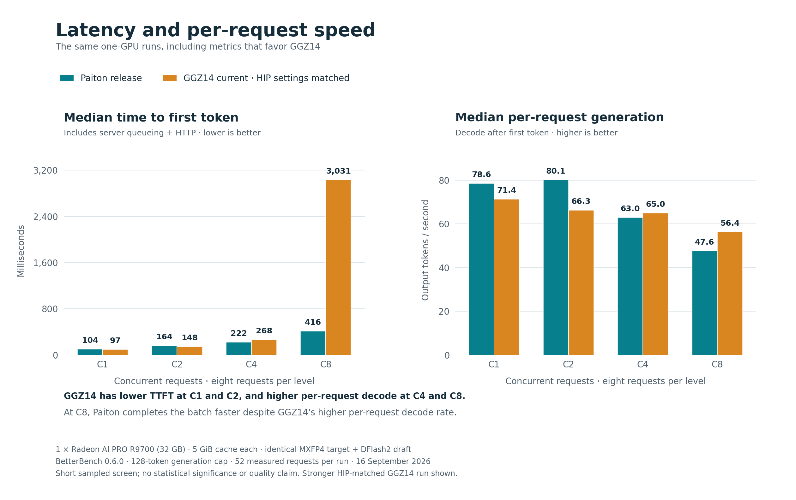

# BetterBench: Paiton versus current GGZ14 on one R9700

**Measured 16 September 2026 · Qwen3.8 27B · BetterBench 0.6.0**

The released Paiton integration delivered **17.45% higher weighted generation throughput**, **82.13% higher aggregate throughput at eight concurrent requests**, and **13–14% faster prefill** than the tested GGZ14 implementation on one Radeon AI PRO R9700. The comparison below uses the stronger GGZ repeat, with matching HIP runtime settings and reused compilation caches.

Both engines used the same AMD MXFP4 checkpoint, FP8 DFlash2 drafter, prompts, sampled generation settings, 128-token output cap, 8K context limit and 5 GiB cache allocation. This is a short serving-stack comparison; it does not reproduce the different NVFP4 checkpoint or two-GPU configuration discussed elsewhere.

[Download SVG](assets/throughput-and-cache.svg) · [Method](METHOD.md) · [Reproduce](REPRODUCE.md) · [Every measured metric](COMPARISON.md)

## Headline results

| Metric | Paiton release repeat | GGZ14, HIP settings matched | Paiton change |
|---|---:|---:|---:|
| Weighted serial decode, tok/s | **98.57** | 83.93 | **+17.45%** |
| Weighted serial end-to-end, tok/s | **91.54** | 78.95 | +15.94% |
| Aggregate at C1, tok/s | **73.98** | 67.31 | +9.92% |
| Aggregate at C2, tok/s | **129.98** | 111.19 | +16.90% |
| Aggregate at C4, tok/s | **201.32** | 156.94 | +28.28% |
| Aggregate at C8, tok/s | **281.90** | 154.78 | **+82.13%** |
| C8 median queue-inclusive TTFT, ms | **416.21** | 3,030.91 | **86.27% lower** |
| Prefill, median 1,545 input tokens, tok/s | **3,375.80** | 2,987.85 | +12.98% |
| Prefill, median 5,234 input tokens, tok/s | **3,395.58** | 2,978.68 | +14.00% |
| Reported capacity at 5 GiB cache, tokens | **74,430** | 25,746 | **2.89×** |

“Prefill” is prompt tokens divided by HTTP time to first token, including first-token and transport overhead. Serial decode is BetterBench's stream-window metric; speculative updates can contain multiple tokens. The weighted end-to-end rate includes TTFT. Cache capacity is reported by the runtime allocator, not a separately stress-tested maximum context length.

## Latency and per-request tradeoffs

[Download SVG](assets/latency-and-per-request.svg).

GGZ has lower median TTFT at concurrency one and two: **96.54/148.02 ms**, versus Paiton's **103.54/164.33 ms**. GGZ also has higher per-request decode at concurrency four and eight: **65.03/56.35 tok/s**, versus **62.99/47.62 tok/s**. Paiton nevertheless completes the concurrent groups faster. Five short-prompt serial categories have 3.6–12.0% higher TTFT with Paiton. All regressions, including small differences that may be noise, remain in the [full table](COMPARISON.md).

Equal cache bytes do not imply equal capacity. The [generic startup log excerpts](evidence/cache-log-excerpts.json) document the capacity difference; the initial GGZ C8 run also logged three running requests and five waiting. Admission and cache efficiency contribute to the large C8 throughput/TTFT difference. This is not an isolated kernel comparison or a sweep of each engine's maximum practical cache settings.

## Every run, including the first upstream result

Runs appear in execution order. Each contains **52 measured requests** and ten additional warmups; all **208 measured requests** completed successfully across the four suites.

| Run | Weighted decode, tok/s | C8 aggregate, tok/s | C8 median TTFT, ms | Evidence |
|---|---:|---:|---:|---|
| Paiton initial | 99.92 | 279.37 | 416.66 | [JSON](data/paiton-release-quick.json) · [HTML](reports/paiton-release-quick.html) · [Report](reports/paiton-release-quick.md) |
| GGZ initial, vendor environment | 66.10 | 136.31 | 3,325.44 | [JSON](data/ggz-current-quick.json) · [HTML](reports/ggz-current-quick.html) · [Report](reports/ggz-current-quick.md) |
| GGZ repeat, matched HIP settings | 83.93 | 154.78 | 3,030.91 | [JSON](data/ggz-current-hipmatched-quick.json) · [HTML](reports/ggz-current-hipmatched-quick.html) · [Report](reports/ggz-current-hipmatched-quick.md) |
| Paiton repeat | 98.57 | 281.90 | 416.21 | [JSON](data/paiton-release-repeat.json) · [HTML](reports/paiton-release-repeat.html) · [Report](reports/paiton-release-repeat.md) |

Download an HTML report and open it locally for the standalone BetterBench visuals; GitHub's file viewer does not execute HTML. No external assets or network service are required.

The upstream repeat matched `DEBUG_HIP_DYNAMIC_QUEUES=0`, `HIP_FORCE_DEV_KERNARG=1`, `HSA_NO_SCRATCH_RECLAIM=1`, and `HSA_ENABLE_IPC_MODE_LEGACY=1` while reusing compilation caches. This changed more than one factor, so the improvement cannot be attributed to a single flag. Paiton's repeat changed weighted decode by −1.36% and C8 aggregate by +0.91%. Some first-use framework JIT warnings remained in both engines; these are not fully warmed sustained-load measurements.

## Versions and scope

| Component | Pin |
|---|---|
| BetterBench | [0.6.0, `d00ad5ec`](https://github.com/GGZ14/BetterBench/tree/d00ad5ec8098c06584a88ec3468bacd37d5ed098) |
| GGZ14/vllm-mxfp4 | [`92eed82f`](https://github.com/GGZ14/vllm-mxfp4/tree/92eed82fcbb1cca31f7a9108c6371a0bba647ee2), tested 16 September 2026 |
| Paiton | [Released image and digest](../../runtime.lock.json), ordinary vLLM 0.28.0+rocm723 |
| Target | `amd/Qwen3.8-27B-Quark-AWQ-MXFP4`, revision `5233554c5fa56afda40150556b95573c2d7d29c0` |
| Draft | `tcclaviger/Qwen3.8-27B-DFlash2-FP8`, revision `ee0cb26a8279b7910cc28d82a8a3e15e4728d56f` |

[Provenance](provenance.json) records complete source/image pins, graph modes, HIP settings, validation counts and original/published hashes. [Checkpoint hashes](../../checkpoint.lock.json) and [independent verification](evidence/checkpoint-verification.json) establish the model files used. Framework versions, graph execution, attention implementations and draft policies differ between these complete serving stacks.

There are only two serial samples per category, eight requests per concurrency level and two samples per prefill depth. Serial testing covers eight categories; the concurrency mix is three chat, four code and one file-edit prompt. Chat and math have zero weight in BetterBench's combined score but are reported separately. Most serial generations reached the 128-token limit: **15/16 Paiton, 14/16 GGZ**. These results do not establish completed-answer quality, statistical significance, p99 latency or universal superiority. The separate [Paiton](evidence/paiton-release-repeat-output-smoke.json) and [GGZ](evidence/ggz-current-hipmatched-quick-output-smoke.json) arithmetic/JSON smoke checks passed, but are not a quality evaluation.

## Evidence package

The four result files retain every measurement, configuration field and sample-size annotation. Only environment metadata was sanitized: hostname, local endpoint, detailed device inventory and private-scope wording. HTML and Markdown reports were regenerated from those sanitized results using the pinned BetterBench renderer, with trailing whitespace normalized. Original and published hashes are distinguished in [provenance.json](provenance.json).

- [Machine-readable comparison](comparison.json), [CSV](comparison.csv) and [all-run summary](summary.json).
- [Exact benchmark profile](profile-quick.json), [bounded corpus](corpus), [corpus hashes](bounded-corpus-manifest.json) and [benchmark source hashes](betterbench-source-manifest.json).
- [Chart source](render_charts.py), [launch/reproduction instructions](REPRODUCE.md), [SHA256 checksums](SHA256SUMS) and [third-party attribution](THIRD_PARTY_NOTICES.md).

Only measurements, public configuration, generic log excerpts and visuals are included. Full internal logs, machine-specific metadata, compiler source and generated implementation details are excluded. The earlier benchmark suites remain separately documented in [BENCHMARKS.md](../../BENCHMARKS.md); their different versions, sampling and output budgets should not be mixed with this comparison.
