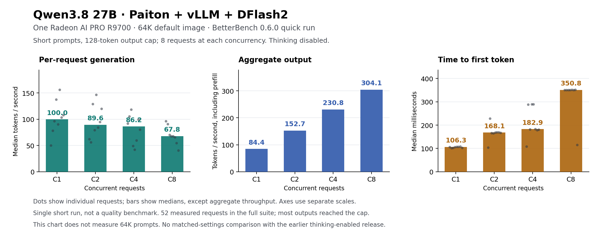

# Qwen3.8 27B: 64K image benchmark and tool support

**Measured 17 September 2026 · One Radeon AI PRO R9700**

The updated 64K image completed the original BetterBench quick workload with **zero request errors or preemptions**. It delivered **304.10 aggregate output tokens/s at eight concurrent requests**, with **67.81 tokens/s median per request** and **350.84 ms median time to first token**. These are short prompts on a 64K-capable image, not a benchmark of 64K prompts.

The release also corrects the tool-call parser and provides a separate 200K image for one active request. Both images are available on GHCR. The previous v1.0.0 image and [16 September comparison](../2026-09-16-betterbench/README.md) remain unchanged.

[SVG](assets/concurrency-64k-quick.svg) · [Standalone HTML report](reports/64k-quick.html) · [Measurements](data/results.json) · [Reproduce](REPRODUCE.md)

## Images and defaults

Both tags are in the [GHCR package](https://github.com/users/Eliovp/packages/container/package/paiton-vllm-plugin). Anonymous manifest access and immutable pulls were verified; the old tag's digest is unchanged.

| Image | Context limit | FP8 cache budget | Maximum active requests |
|---|---:|---:|---:|
| `ghcr.io/eliovp/paiton-vllm-plugin:qwen38-mxfp4-dflash2-rdna4-v1.1.0` | 65,536 | 5 GiB | 8, subject to cache capacity |
| `ghcr.io/eliovp/paiton-vllm-plugin:qwen38-mxfp4-dflash2-rdna4-200k-v1.1.0` | 200,000 | 8 GiB | 1 |

Both use `qwen3_xml` tool parsing, `qwen3` reasoning parsing, and **thinking disabled by default**. A request can explicitly enable thinking. Image digests are recorded in the [64K receipt](evidence/image-64k.json) and [200K receipt](evidence/image-200k.json); [launch instructions](../../LAUNCH-agentic-v1.1.0.md) and [support notes](../../SUPPORT.md) explain the profiles.

The pinned [target configuration](https://huggingface.co/amd/Qwen3.8-27B-Quark-AWQ-MXFP4/blob/5233554c5fa56afda40150556b95573c2d7d29c0/config.json) and [draft configuration](https://huggingface.co/tcclaviger/Qwen3.8-27B-DFlash2-FP8/blob/ee0cb26a8279b7910cc28d82a8a3e15e4728d56f/config.json) both declare 262,144 positions. The packaged limits are practical serving choices: 64K keeps a smaller 5 GiB cache, more memory headroom, and room for several short requests; 200K uses 8 GiB and one active request. Each context limit covers **prompt plus output tokens** and is not the model's architectural maximum.

## Quick benchmark

This is the same frozen BetterBench 0.6.0 workload used previously: **52 measured requests plus 10 discarded warmups**, temperature 0.7, top_p 0.95, top_k 20, seed 42, and outputs capped at 128 tokens. Prefill probes retain upstream temperature 0 and a 16-token cap. The run took 64.63 seconds overall. The target and DFlash2 checkpoint revisions are unchanged.

| Concurrent requests | Median per-request generation, tok/s | Aggregate output, tok/s | Median client TTFT, ms | Draft token acceptance |
|---:|---:|---:|---:|---:|
| 1 | 99.95 | 84.42 | 106.29 | 43.64% |
| 2 | 89.55 | 152.69 | 168.05 | 47.29% |
| 4 | 86.16 | 230.76 | 182.87 | 45.87% |
| 8 | 67.81 | 304.10 | 350.84 | 47.91% |

Each concurrency level submitted eight original fixtures: three chat, four code, one file-edit. Actual prompts were **69–116 tokens**, with **77–128 output tokens**. Serial testing separately covered all eight categories with two measured samples each. The [full report](reports/64k-quick.md) retains every category.

Per-request generation uses BetterBench's `(completion_tokens − 1) / (last − first streamed update)`. Aggregate throughput divides all completed output tokens by the concurrency phase's wall time, including prefill. Client TTFT includes HTTP and server waiting, but excludes time waiting on the client's concurrency semaphore. Speculative updates can contain multiple tokens; their gaps are not individual-token latencies.

### Prefill

| Nominal depth | Actual measured input tokens | Median prompt tokens / client TTFT, tok/s | Prompt tokens / server prefill phase, tok/s |
|---:|---|---:|---:|
| 2,000 | 1,520; 1,490 | 3,478.88 | 3,543.46 |
| 7,000 | 5,171; 5,217 | 3,371.17 | 3,409.20 |

The last column includes each depth's one warmup plus two measured requests because the saved counters cover that whole phase. Server prefill phase is request residence time, not isolated GPU kernel execution. All four measured prefill probes ended normally after two output tokens.

### Limits of this run

**37 of 52 measured outputs reached the token cap.** Successful requests and speed do not establish completed-task quality. There are too few samples for reliable tail percentiles or statistical superiority claims. One existing vLLM causal-convolution JIT warning occurred during C4; the [scheduler excerpt](evidence/scheduler.log) preserves it. No repeat was selected to replace that result.

The previous release used the checkpoint's thinking default. This run intentionally measures the new no-thinking default; the original requests omit `chat_template_kwargs` in both cases. Generated content, token counts and speculative acceptance can therefore differ. This is **not a matched-settings speedup comparison** with the old release or another engine. The separate [historical comparison](../2026-09-16-betterbench/README.md) must keep its own settings and conclusions.

## Separate long-context and tool checks

These functional tests used the final packaged images and are separate from the short-prompt throughput table. Each long-context response generated only 57 tokens and retrieved three exact markers from repetitive filler; this does not establish general long-context reasoning quality.

| Packaged profile | Submitted workload | Correct retrieval | Client TTFT | Client completion |
|---|---|---|---|---|
| 64K, 5 GiB cache | Two simultaneous 62,983-token prompts | Both passed | 24.579 / 49.744 s | 25.021 / 50.190 s |
| 200K, 8 GiB cache, one active request | One 195,999-token prompt | Passed | 126.095 s | 126.681 s |

The two 64K requests were handled with queueing: the summed server queue interval was 23.729 seconds, with zero preemptions. This does not mean two full-length contexts fit in memory simultaneously. The packaged 200K run measured 125.562 seconds in prefill, or 1,561.0 input tokens/s, also with zero preemptions. The preceding 200K preparation run sampled only about **129 MiB of remaining VRAM**. Its tight memory margin and one-active-request setting are material limits. [64K raw results](evidence/context-64k-summary.json) · [200K raw results](evidence/context-200k-summary.json) · [Counter deltas](evidence/context-derived.json).

The original image reproduced XML tool syntax left without structured API calls: **0/4** basic read/write probes passed. The packaged images each passed **4/4** streaming/non-streaming probes and both read-result follow-ups after the parser correction. An explicit thinking-enabled API control also passed during validation. These API tools were simulated. Separately, **actual OpenCode 1.18.31** completed a real file read and write: a random marker absent from its prompt was read from a file and written into the correct JSON result. This validates that bounded client/tool round trip, not complex autonomous coding or a reproduction of an unpublished user prompt. [Before](evidence/baseline-tools-summary.json) · [64K tool results](evidence/tools-64k-summary.json) · [200K tool results](evidence/tools-200k-summary.json) · [OpenCode acceptance](evidence/opencode-acceptance.json).

## Evidence and provenance

- [Exact request payloads and per-request timing records](data/requests.jsonl), including labelled warmups and all concurrency requests; these records do not contain generated answer transcripts.
- [BetterBench results](data/results.json), [validation counts](data/validation.json), [derived summary](summary.json), and [allowlisted raw phase metrics](evidence/metrics).
- [Generic scheduler/speculation log](evidence/scheduler.log), [HTML](reports/64k-quick.html), and [Markdown report](reports/64k-quick.md). Download HTML and open it locally; GitHub does not execute it in the file viewer.
- [Benchmark profile](profile-quick.json), [source hashes](betterbench-source-manifest.json), [corpus hashes](bounded-corpus-manifest.json), [export provenance](provenance.json), [checksums](SHA256SUMS), and [attribution](THIRD_PARTY_NOTICES.md).

Measurements and request payloads are preserved. Environment identity/inventory and local paths were sanitized; reports were regenerated with the pinned upstream renderer. Metric and log exports contain only allowlisted serving evidence. Original files and their hashes remain archived separately. Compiler source, generated implementation details, full internal logs, and machine-specific metadata are excluded.
