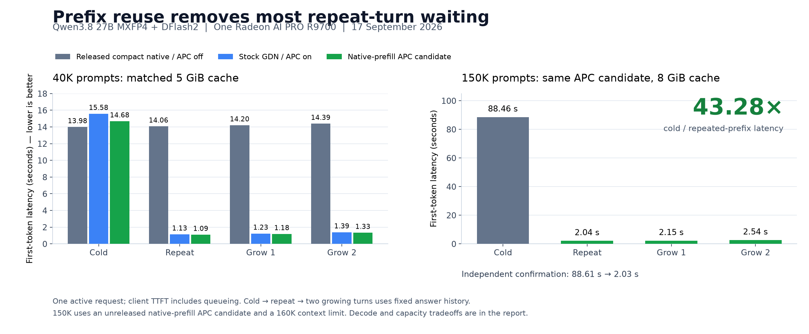

# Prefix caching: much shorter waits in long conversations

17 September 2026 · One Radeon AI PRO R9700, 32 GB

**Reusing conversation history can save far more time than improving decode alone.** Our tested APC candidate reduced first-token latency for a 149,977-token prompt from **88.46 seconds cold to 2.04 seconds cached: 43.28× faster**. A second independent prefix reproduced the result at **88.61 → 2.03 seconds**. Growing follow-ups took **2.15 and 2.54 seconds**.

Thanks to the community contributor who identified our missing workload and demonstrated the workaround. Our released profiles disable automatic prefix caching (APC) because compact native GDN replay does not yet support it. That makes repeated conversations reprocess their shared history. Our earlier fresh-prompt benchmarks did not measure this cost.

APC is vLLM's existing reuse mechanism. This investigation integrates it with the Paiton plugin and measures its benefits and tradeoffs. **These are targeted conversation tests, not new BetterBench or competitor results.**



[SVG figure](assets/prefix-reuse-latency.svg) · [Plot data](assets/plot-data.json) · [Measurements](results.json) · [Raw evidence archive](raw-evidence.tar.gz)

## Availability and when to use it

**The published images have not changed.** They still default to APC off and do not implement `PAITON_PREFIX_CACHING=1`. The [reproduction instructions](REPRODUCE.md) show how to test stock GDN plus APC using the existing pinned image and an explicit profile override.

Our local launcher candidate adds `PAITON_PREFIX_CACHING=1` or `--enable-prefix-caching`, with APC off by default. It selects vLLM's aligned cache mode and disables incompatible compact replay. The optional native-prefill candidate described below is also local; reproducing its exact results requires that adapter, which is not distributed with this report. This publication does not release a new runtime or GHCR image.

| Choose | Useful for | Cost |
|---|---|---|
| APC on | Long coding conversations, repeated documents, shared prompt prefixes | Current fallback has lower decode speed and usable cache capacity |
| APC off | Fresh prompts, generation-heavy requests, compact-state capacity | Shared history is recomputed on later turns |

Only matching cached prefixes help. Changed early tokens, eviction, or a restarted server can require cold processing again. APC is therefore an option, not a universal upgrade.

## Matched 64K experiment

All four arms used the same target, tokenizer, drafter, requests and sampling settings: **65,536 total context, 5 GiB FP8 cache, one active request, 4,096-token chunk budget, DFlash K7, synchronous scheduling**, greedy temperature 0, top_p 1, request seed 42, and thinking disabled. Retrieval outputs had a 192-token budget and ended naturally. A separate long warmup was excluded.

| Arm | Recurrent implementation | APC |
|---|---|---|
| A | Released compact native path | Off |
| B | Stock vLLM GDN control | Off |
| C | Stock vLLM GDN | On, aligned |
| D | Stock state/decode with native recurrent prefill | On, aligned |

D retains stock state ownership and convolution while reusing an existing native prefill library. No model weights changed, no new native binary was built, and ordinary vLLM remained the engine.

| 40K workload | A | B | C | D |
|---|---:|---:|---:|---:|
| Cold TTFT | 13.985 s | 15.333 s | 15.578 s | 14.680 s |
| Identical repeat TTFT | 14.063 s | 15.423 s | 1.133 s | 1.089 s |
| First growing follow-up TTFT | 14.203 s | 15.583 s | 1.231 s | 1.179 s |
| Second growing follow-up TTFT | 14.388 s | 15.783 s | 1.386 s | 1.326 s |
| Four-request elapsed sum | 58.992 s | 64.619 s | 21.736 s | 20.678 s |

The sequence is **cold, identical repeat, then two growing turns**, not four natural chat turns. D reduced its total elapsed time by **64.95%** versus A; the 8K equivalent fell from **12.066 to 7.475 seconds**. At 40K, C/D repeats reused **37,904 tokens** and computed **2,090**. Changing the early prefix caused the expected miss; a later branch also missed after eviction.

Relative to stock APC, native prefill reduced cold TTFT by **5.77% at 40K** and **6.53% at 8K**. An independent 40K prefix showed **4.02%**. These are small-sample observations, not universal percentages.

## Approximately 150K prompts

This separate D-only experiment used **160,000 configured context, an 8 GiB cache and one active request**. It compares cold versus cached within that profile; it is not an equal-cache comparison against A.

| Measurement | First prefix | Independent second prefix |
|---|---:|---:|
| Cold prompt tokens | 149,977 | 149,977 |
| Cold TTFT | 88.458 s | 88.611 s |
| Identical repeat TTFT | 2.044 s | 2.033 s |
| Cold/repeat ratio | 43.28× | 43.59× |
| Reused / newly computed tokens | 148,320 / 1,657 | 148,320 / 1,657 |

Both cold requests recorded zero cache hits. The largest tested prompt was **150,645 tokens**, followed by 84 output tokens. This does not qualify full 160K or 200K inference.

## Tradeoffs and validation limits

The two measured 512-token code-generation probes averaged **151.17 / 128.66 / 126.88 / 124.30 output tok/s** for A/B/C/D. These use streaming-delta timing; speculative chunks complicate token-level interpretation. A and D produced different continuations and draft acceptance, so the rates measure observed serving behavior, not isolated kernel cost or quality. B/C outputs and acceptance matched, but two samples do not establish their small difference robustly. These capped probes do not score completed code.

At the same 5 GiB budget, startup-reported cache capacity was **119,088 / 85,063 / 81,727 / 81,727 token-equivalents** for A/B/C/D. These context-dependent estimates are not linear memory-density measurements. **200K with an 8 GiB cache fails the pinned stock-APC sizing calculation**, which requires about 9.163 GiB before the null-block margin. That is a CPU sizing rejection, not an observed GPU OOM; a larger allocation remains untested.

All **56 main retrieval/history checks**, **six 150K checks**, and **six actual cached-tool checks** passed. Tool tests reused the returned assistant tool call and checked changed, previously unseen tool results. A separate client-concurrency 1/2/4/8 smoke passed 17/17 requests, but queueing and compilation make it unsuitable for throughput claims. No preemptions were observed. vLLM selected **FULL_DECODE_ONLY** graphs; full-prefill graph execution is not claimed.

These tests do not establish broad model quality, bitwise equivalence, or cancellation/preemption robustness. Fixed correct assistant history makes the retrieval comparisons reproducible; it does not simulate every detail of an interactive coding session.

## Pins, measurement and evidence

Runtime: **vLLM 0.28.0+rocm723 / ROCm 7.2.3**, one R9700, 16 GiB host RAM. Base image:

```text
ghcr.io/eliovp/paiton-vllm-plugin@sha256:c3ec2528285b484b2e0af7f571f80f1da23c1970210e4d3d09f5d2a909414186
```

Target `amd/Qwen3.8-27B-Quark-AWQ-MXFP4` revision `5233554c5fa56afda40150556b95573c2d7d29c0`; drafter `tcclaviger/Qwen3.8-27B-DFlash2-FP8` revision `ee0cb26a8279b7910cc28d82a8a3e15e4728d56f`. File hashes are in the [checkpoint lock](../../checkpoint.lock.json).

TTFT runs from client request start to the first nonempty streamed content and includes queueing. Elapsed sums exclude inter-request gaps. Server prefill/decode metrics measure request-phase wall time, not GPU kernel time. Cache-hit and computed-token counters distinguish reused history from actual prefill work.

See [readable measurements](results.json), [raw request/response and metric evidence](raw-evidence.tar.gz), [provenance](provenance.json), [source/export hashes](raw-input-manifest.json), [checksums](SHA256SUMS), [reproduction](REPRODUCE.md), and the [model README](../../README.md). The compressed archive includes exact frozen prompts, timestamped streamed responses, before/after counters and the HTTP benchmark clients. Machine-specific paths are sanitized; compiler source, generated implementation details and full internal logs are excluded. The next optimization target is APC with compact native recurrent state, to retain reuse while recovering decode speed and capacity. Existing native-library [third-party attribution](../../THIRD_PARTY_NOTICES.md) continues to apply.
