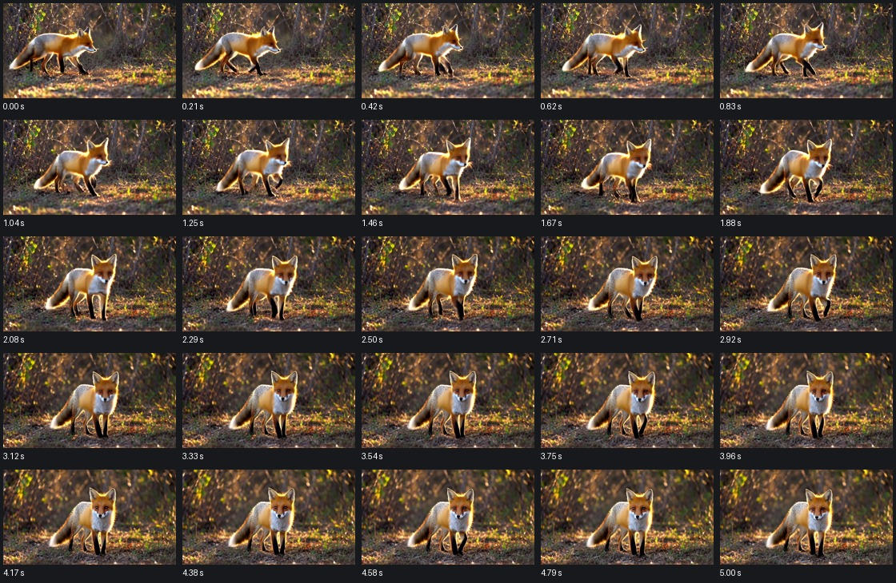
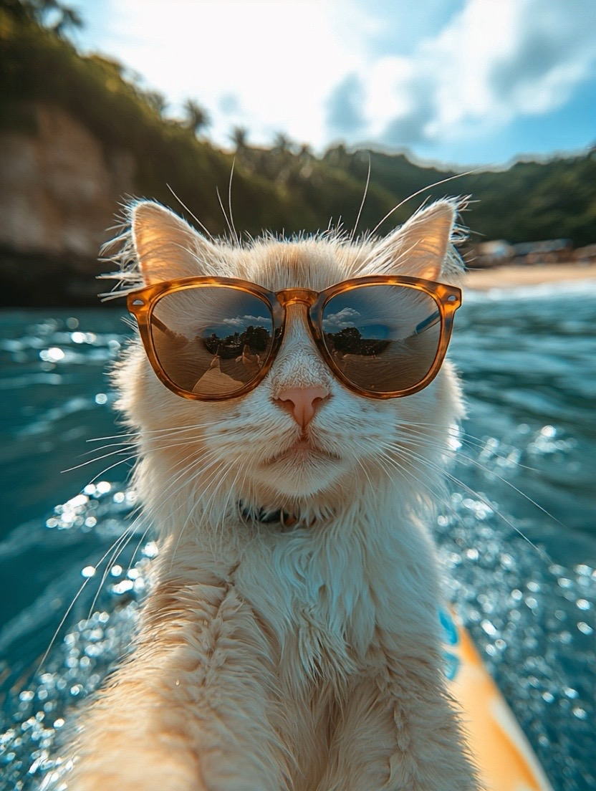

# Clip quality evidence

All fourteen representative stock/Paiton clips decoded successfully with the expected dimensions, frame counts and 24 fps. No exact duplicate decoded frames or non-finite generation outputs were found. Both measured latent pairs for every setting were bitwise equal between stock and Paiton. The VAE fusion changes some decoded pixels: encoded-video PSNR ranges from **37.22 to 40.73 dB**.

These checks support numerical consistency, not universal semantic parity. The small fixed set covers animal motion, a person in a multi-action scene and image-conditioned subject preservation. [Exact prompts and seeds](benchmark-cases.json), [per-case numerical comparisons](benchmark-data/quality-summary.json), full-frame metadata and frame statistics are retained.

## Comparison demo

<video controls muted preload="metadata" src="assets/comparison-demo.mp4"></video>

[Play/download the side-by-side demo](assets/comparison-demo.mp4). Stock is on the left, Paiton on the right. It contains a native five-second fox clip, a short person clip and a short image-conditioned cat clip. Cuts between cases are comparison edits, not stitched native generation. The original clips below have no interpolation or audio.

## What the examples show

- **FastWan fox:** recognizable, consistent subject; walking followed by a pause/head turn toward the camera. The five-second clip becomes relatively still near its end. Fine fur and foliage vary between frames; this is not evidence of universally flicker-free output.
- **FastWan person:** yellow coat, wet sidewalk, flowers and a smiling, consistent subject are present. She approaches the camera rather than clearly stopping to admire the flowers. The complete requested action sequence is only partially followed.
- **Base image input:** the cat and sunglasses remain recognizable while the head turns; water and boat edges remain in the scene. The longer clip looks around in more than one direction. Native preprocessing crops the original image to the selected canvas, so exact full-frame composition is not preserved.
- **Base text fox:** recognizable animal and forward movement, but more saturated foliage and a less clear walk-then-turn sequence than the FastWan example. This is one reason FastWan is the text default.
- **Stock/Paiton comparison:** no obvious change in subject identity or motion sequence was seen in the inspected pairs. Pixel differences remain, and these examples do not establish quality for arbitrary prompts, fast motion or fine hand/face detail.

## Retained pairs

All rows use seed 1201 except the person case, which uses 2702. Frame rate is 24 fps; 49/121 frames encode 2.0417/5.0417 seconds.

| Case | Stock clip | Paiton clip | Contact sheets, stock / Paiton | Encoded PSNR |
| --- | --- | --- | --- | ---: |
| FastWan 832×480, 49f | [Video](assets/fast-480-2-stock.mp4) | [Video](assets/fast-480-2-paiton.mp4) | [Stock](assets/fast-480-2-stock.jpg) / [Paiton](assets/fast-480-2-paiton.jpg) | 39.83 dB |
| FastWan 832×480, 121f | [Video](assets/fast-480-5-stock.mp4) | [Video](assets/fast-480-5-paiton.mp4) | [Stock](assets/fast-480-5-stock.jpg) / [Paiton](assets/fast-480-5-paiton.jpg) | 39.76 dB |
| FastWan 1280×704, 49f, person | [Video](assets/fast-720-2-person-stock.mp4) | [Video](assets/fast-720-2-person-paiton.mp4) | [Stock](assets/fast-720-2-person-stock.jpg) / [Paiton](assets/fast-720-2-person-paiton.jpg) | 40.73 dB |
| FastWan 1280×704, 121f | [Video](assets/fast-720-5-stock.mp4) | [Video](assets/fast-720-5-paiton.mp4) | [Stock](assets/fast-720-5-stock.jpg) / [Paiton](assets/fast-720-5-paiton.jpg) | 40.23 dB |
| Base text, 832×480, 49f | [Video](assets/base-480-2-stock.mp4) | [Video](assets/base-480-2-paiton.mp4) | [Stock](assets/base-480-2-stock.jpg) / [Paiton](assets/base-480-2-paiton.jpg) | 37.22 dB |
| Base image, 480×832, 49f | [Video](assets/base-480-2-image-stock.mp4) | [Video](assets/base-480-2-image-paiton.mp4) | [Stock](assets/base-480-2-image-stock.jpg) / [Paiton](assets/base-480-2-image-paiton.jpg) | 38.38 dB |
| Base image, 480×832, 121f | [Video](assets/base-480-5-image-stock.mp4) | [Video](assets/base-480-5-image-paiton.mp4) | [Stock](assets/base-480-5-image-stock.jpg) / [Paiton](assets/base-480-5-image-paiton.jpg) | 38.24 dB |

The full per-frame statistics include hashes, luminance/contrast summaries and adjacent-frame differences. Nonzero adjacent-frame difference does not prove natural motion; exact-duplicate detection does not detect every near-static or flickering frame. [Chromium playback checks](benchmark-data/browser-playback.json) reached the end of all 17 retained videos, including the candidate clips and demo, with no dropped frames reported. They supplement the contact sheets and metrics.

## Input image and framing

This is the upstream example from the pinned Apache-2.0 Wan model repository. [Input provenance and SHA256](assets/input-provenance.json) identify the exact source. The original is 832×1104; the tested 480×832 canvas is narrower, so native preprocessing crops the sides. Assess preservation of the cat and scene separately from that known framing change.

## A14B quantization comparison

The exploratory A14B/Seko clips show a natural-colored fox walking and turning toward the camera. Both the dequantized-BF16 and W4A8 compute settings retain that sequence in this example, although pose/pixel details differ (encoded PSNR **20.89 dB**). This one comparison does not establish general quantization parity.

- [UINT4 storage with BF16 compute clip](assets/candidate-stock-a14b-sdnq4-seko4.mp4) and [contact sheet](assets/candidate-stock-a14b-sdnq4-seko4.jpg).
- [W4A8 compute clip](assets/candidate-stock-a14b-sdnq-w4a8-seko4.mp4) and [contact sheet](assets/candidate-stock-a14b-sdnq-w4a8-seko4.jpg).
- [Raw quantization comparison](benchmark-data/candidates/quantization-comparison.json).

These are 832×480, 49 frames at **16 fps**, or 3.0625 seconds, with two high-noise and two low-noise evaluations. They are separate model/runtime settings, not matched Paiton comparisons. See [candidate assessment](CANDIDATES.md) for the memory, latency and licensing tradeoffs.
