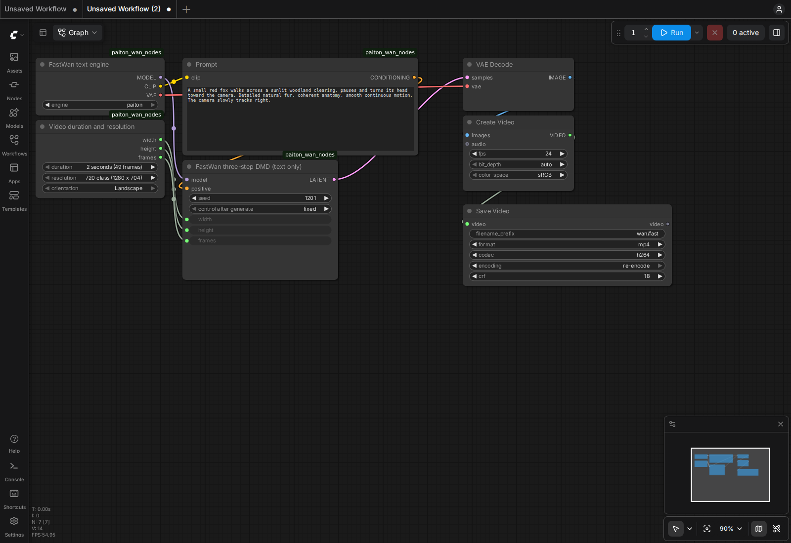

# Wan2.2 on Radeon AI PRO R9700

Local text-to-video and image-to-video with separate **stock** and **Paiton** choices. FastWan FullAttn 5B provides a three-evaluation text preview; original Wan2.2 TI2V-5B provides optional image input. Both produce silent video. This package is prepared locally for review; publication is pending.

FastWan Paiton reduced complete-clip latency by **2.8–4.7%** in the fixed R9700 set. The base image cases did not improve end to end, so they default to stock. [See the measurements](BENCHMARKS.md) and [retained clips](QUALITY.md).

## Launch ComfyUI

From this repository checkout:

```bash
./models/Wan2.2/launch.sh
```

Open [FastWan text workflow](http://127.0.0.1:8192/?paiton=1&preset=fast) or [Wan image/text workflow](http://127.0.0.1:8192/?paiton=1&preset=base). The connected workflow opens on first visit. Choose `stock` or `paiton` in its loader, edit the prompt, set duration/resolution and click **Run**. The base workflow includes image upload; choose `(none)` for text-only generation. Use portrait orientation for the supplied portrait example. Native Wan image conditioning resizes and center-crops to the chosen canvas; it does not preserve every input edge.

ComfyUI listens on **0.0.0.0:8192**. From another machine, replace `127.0.0.1` with the server's address. This is a separate service and port from H3. Existing models, caches and outputs are not replaced.

The first launch builds the pinned local runtime and downloads both presets. Subsequent launches reuse model and runtime caches. To download only the text preset, set `PAITON_WAN_DOWNLOAD_PRESET=fast`; the base workflow then needs a later base/all download. Workflow files are also in [comfyui/workflows](comfyui/workflows), with matching API examples.

```bash
./models/Wan2.2/launch.sh --logs
./models/Wan2.2/launch.sh --stop
```



[Image-upload workflow screenshot](assets/comfy-base-upload.png)

## Settings

| Preset | Input | Resolution controls | Duration controls | Sampling |
| --- | --- | --- | --- | --- |
| `fast` | Text | 832×480 or 1280×704, landscape | 49 or 121 frames | Three DMD evaluations, guidance 1 |
| `base` | Text and optional image | 832×480 landscape or 480×832 portrait | 49 or 121 frames | 20 UniPC steps, simple schedule, shift 8, guidance 5 |

All outputs use 24 fps. The UI's “2 seconds” and “5 seconds” labels correspond to 49/121 frames: encoded duration is **2.0417/5.0417 seconds**, with first-to-last-frame timestamps spanning 2/5 seconds. Wan uses a `4n+1` frame grid. “720 class” here means **1280×704**, not 1280×720. Longer clips are native continuous generations, without stitching or interpolation. FastWan image input is not qualified; use `base`. Five-second base evidence here is image-conditioned; the base text benchmark uses 49 frames.

The text default is a short 720-class clip. Select 480 class for a faster preview, or five seconds for longer motion with higher generation time. The base image workflow defaults to 480 class and stock; FastWan defaults to Paiton. The short base image benchmark did not show a complete-clip Paiton gain. These choices do not inherit H3's duration limits or audio capabilities.

## Terminal generation and fair benchmarks

```bash
./models/Wan2.2/run.sh generate --preset fast --engine paiton \
  --resolution 720 --duration 5 --seed 1201 \
  --prompt 'A red fox walks through a sunlit woodland clearing and turns toward the camera.'

./models/Wan2.2/run.sh benchmark --preset fast --engine stock \
  --resolution 480 --duration 2 --runs 6 --warmups 2
./models/Wan2.2/run.sh benchmark --preset fast --engine paiton \
  --resolution 480 --duration 2 --runs 6 --warmups 2
```

Put an input image under the data directory's `input/` folder, then use its container path:

```bash
./models/Wan2.2/run.sh generate --preset base --engine stock \
  --portrait --duration 2 --image /data/input/example.jpg \
  --prompt 'The subject slowly turns toward the camera. Preserve the subject and composition.'
```

Outputs get unique directories under `~/paiton-videos`. Explicit `--output /outputs/my-run` must name a new or empty directory. Each benchmark retains commands/settings, clips, latents, component timings, actual denoiser calls and sampled telemetry. Warmups are retained and marked, not mixed into warm statistics. Fresh text conditioning runs every time, including repeated UI requests; loaded components may remain cached.

The terminal benchmark includes H.264 encoding (CRF 18, preset `fast`). The UI uses ComfyUI's native SaveVideo node at CRF 18; UI encoding behavior is not used as the terminal benchmark baseline. Run one generation process at a time.

## Requirements and persistent storage

- Linux, Docker with Compose, working AMD ROCm device access (`/dev/kfd`, `/dev/dri`), one **gfx1201 R9700 with 32 GB VRAM**. This artifact is hardware-specific.
- Qualification host: approximately 15 GiB usable RAM and 4 GiB swap. Leave headroom for the OS and loading; 32 GB system RAM is a more comfortable installation. Detailed measured peaks belong in [BENCHMARKS.md](BENCHMARKS.md).
- Model storage: about 18.15 GB for base, or 28.15 GB for fast including the retained 10 GB original and its lossless converted copy. Both presets use about **38.15 GB** together. Container layers, build caches, compiler caches and retained videos need additional space; allow **100 GB free disk** for a fresh build and both presets.
- First launch includes network downloads and container assembly. First generation includes model loading and compilation; it is substantially slower than warm generation. Download speed and build-cache state determine installation time, so warm clip time is not a first-run estimate.

Defaults:

| Variable | Default |
| --- | --- |
| `PAITON_WAN_DATA` | `${XDG_DATA_HOME:-$HOME/.local/share}/paiton/wan22` |
| `PAITON_WAN_OUTPUTS` | `$HOME/paiton-videos` |
| `PAITON_WAN_PORT` | `8192` |

Model originals live in `cache/hub`; model links stay relative to the data directory. Converted FastWan weights include a pinned provenance manifest. Container compiler caches use `cache/inductor-container`, separate from host execution caches because compiler cache entries can contain absolute paths. No model conversion overwrites originals.

## What Paiton changes

Paiton compiles and fuses Wan VAE channel normalization with the following SiLU for the measured BF16 shapes. Stock convolutions, denoiser, attention, conditioning, sampler and RNG behavior remain shared. Both engines use the qualified CK attention backend, native scaled-FP8 text encoder, BF16 denoiser/VAE, MIOpen and block-level `torch.compile`. Full-pipeline graph capture is disabled after an actual capture failure in the dynamic loader.

The VAE optimization produces small pixel-rounding differences; it does not change denoised latents in the paired checks. Its decode improvement is larger than its complete-clip improvement because sampling and file encoding remain substantial. See the actual measurements and examples rather than assuming a fixed percentage.

- [Complete benchmarks and experiment record](BENCHMARKS.md)
- [Quality evidence and comparison clips](QUALITY.md)
- [Candidate selection and quantization assessment](CANDIDATES.md)
- [Pinned model/source revisions](checkpoints.lock.json)
- [Licenses and redistribution](THIRD_PARTY_NOTICES.md)

## Container and release layout

`Dockerfile` prepares a separate artifact image using the existing pinned community runtime. `Dockerfile.local` assembles pinned ComfyUI core/frontend locally, following the existing community packaging convention. The launch script builds local tags `paiton-wan22-artifacts:local-v1` and `paiton-wan22:local-v1`; it does not require an unpublished Wan image. Use `launch.sh --build` after modifying package code.

A proposed publication would need a **new Wan artifact image**, not an H3 retag. The combined ComfyUI image is local assembly only. No model weights or private compiler source are distributed in this directory. Nothing has been pushed or published by this preparation.


## Measured warm clips

| Setting | Stock clip s | Paiton clip s | Paiton change |
| --- | ---: | ---: | ---: |
| FastWan 1280×704, 49f, person | 20.376 | 19.797 | +2.84% |
| FastWan 832×480, 49f, fox | 9.280 | 8.843 | +4.71% |
| FastWan 1280×704, 121f, fox | 51.986 | 50.109 | +3.61% |
| Base 480×832, 49f, image | 29.518 | 29.758 | -0.81% |

Complete times include fresh conditioning and H.264 file encoding. Each mean uses two measured runs after two warmups on one R9700. Positive change means faster; the base image case did not improve. See [all cases, ranges, memory and component times](BENCHMARKS.md).
